[TOC]

@Comment 这里大部分内容都是维基百科 IPv6 词条的翻译@

@Ref [IPv6](https://en.wikipedia.org/wiki/IPv6)@

## IPv6 详解

### 概览

Internet 协议版本 6 (IPv6) 是 Internet 协议 (IP) 的最新版本，该协议为网络上的计算机提供识别和定位系统，并通过 Internet 路由流量。 IPv6 由 Internet 工程任务组 (IETF) 开发，旨在解决人们期待已久的 IPv4 地址耗尽问题，旨在取代 IPv4。1998 年 12 月，IPv6 成为 IETF 的草案标准，随后被批准为 2017 年 7 月 14 日的互联网标准。

互联网上的设备被分配了一个唯一的 IP 地址，用于识别和位置定义。随着互联网在 1990 年代商业化后的快速增长，很明显，连接设备所需的地址将远远超过 IPv4 地址空间可用的地址。到 1998 年，IETF 正式确定了后续协议。 IPv6 使用 128 位地址，理论上允许 $2^{128}$个或大约 $3.4 \times 10^{38}$ 个总地址。实际数字略小，因为多个范围保留用于特殊用途或完全不使用。这两种协议并非设计为可互操作的，因此它们之间的直接通信是不可能的，从而使向 IPv6 的迁移变得复杂。然而，已经设计了几种过渡机制来纠正这一点。

除了更大的寻址空间之外，IPv6 还提供其他技术优势。特别是，它允许使用分层地址分配方法来促进 Internet 上的路由聚合，从而限制路由表的扩展。多播寻址的使用得到扩展和简化，并为服务交付提供了额外的优化。在协议的设计中已经考虑了设备移动性、安全性和配置方面。

IPv6 地址表示为八组，每组四个十六进制数字，用冒号分隔。有时，完整的地址会进行缩略处理；例如，2001:0db8:0000:0000:0000:8a2e:0370:7334 变为 2001:db8::8a2e:370:7334。

### 主要功能

IPv6 是一种用于分组交换互联网络的 Internet 层协议，提供跨多个 IP 网络的端到端数据报传输，紧密遵循该协议的前一版本 Internet 协议版本 4 (IPv4) 中开发的设计原则。

除了提供更多地址外，IPv6 还实现了 IPv4 中没有的功能。 它在更改网络连接提供商时简化了地址配置、网络重新编号和路由器公告等方面。 它通过将数据包分段的责任置于端点中来简化路由器中数据包的处理。 IPv6 子网大小通过将地址的主机标识符部分的大小固定为 64 位来标准化。

IPv6 的寻址架构在 RFC 4291 中定义，允许三种不同类型的传输：单播、任播和多播。

IPv6 相关术语

### 起源和变迁

#### IPv4 概览

Internet 协议版本 4 (IPv4) 是 Internet 协议的第一个公开使用的版本。 IPv4 是由美国国防部机构国防高级研究计划局 (DARPA) 作为研究项目开发的，后来成为 Internet 和万维网的基础。 IPv4 包括一个使用由 32 位组成的数字标识符的寻址系统。这些地址通常以点十进制表示法显示为四个八位字节的十进制值，每个八位字节的范围为 0 到 255，或每个数字 8 位。因此，IPv4 提供了 232 个或大约 43 亿个地址的寻址能力。 IPv4 最初并不担心地址耗尽问题，因为该版本最初被认为是对 DARPA 网络概念的测试。在互联网运营的第一个十年中，很明显必须开发一些方法来节省地址空间。在 1990 年代初期，即使在使用无类别网络模型重新设计寻址系统之后，很明显这不足以防止 IPv4 地址耗尽，需要对 Internet 基础设施进行进一步的更改。

互联网号码分配机构 (IANA) 于 2011 年 2 月将最后未分配的 1600 万个 IPv4 地址的顶级地址块分配给五个地区互联网注册管理机构 (RIR)。但是，每个 RIR 仍然有可用的地址池，并且预计将继续使用标准地址分配策略，直到保留一个 /8 无类域间路由 (CIDR) 块。之后，RIR 只会将 1,024 个地址 (/22) 的块提供给本地互联网注册机构 (LIR)。截至 2015 年 9 月，亚太网络信息中心 (APNIC)、Réseaux IP Européens 网络协调中心 (RIPE_NCC)、拉丁美洲和加勒比网络信息中心 (LACNIC) 和美国互联网号码注册中心 (ARIN)这个阶段。这使得非洲网络信息中心 (AFRINIC) 成为唯一仍在使用普通协议分发 IPv4 地址的区域互联网注册机构。截至 2018 年 11 月，AFRINIC 的最低分配是 /22 或 1024 个 IPv4 地址。当大约 80% 的地址空间已被使用时，LIR 可能会收到额外的分配。

RIPE NCC 于 2019 年 11 月 25 日宣布其 IPv4 地址已完全用完，并呼吁在采用 IPv6 方面取得更大进展。

人们普遍预计，在可预见的未来，互联网将仍将继续同时使用 IPv4 和 IPv6。

IPv4 地址耗尽时间轴

#### IPv4 地址耗尽

IPv4 地址耗尽是未分配的 IPv4 地址池的耗尽。由于最初的互联网架构只有不到 43 亿个可用地址，因此自 1980 年代末期互联网开始经历急剧增长以来，就预计会出现枯竭。这种耗尽是开发和部署其后继协议 IPv6 的原因之一。 IPv4 和 IPv6 在 Internet 上共存。

IP 地址空间由互联网号码分配机构 (IANA) 和五个区域互联网注册管理机构 (RIR) 在其指定的领土内负责分配给最终用户和本地互联网注册管理机构，例如互联网服务提供商。加速 IPv4 地址耗尽的主要市场力量包括快速增长的互联网用户数量、始终在线设备和移动设备。

预期的短缺一直是创建和采用几种新技术的驱动因素，包括网络地址转换 (NAT)、1993 年的无类别域间路由 (CIDR) 和 1998 年的 IPv6。

顶级耗尽发生在 2011 年 1 月 31 日。所有 RIR 都已耗尽其地址池，但为 IPv6 过渡保留的地址池除外；这发生在 2011 年 4 月 15 日，亚太地区 (APNIC)，2014 年 6 月 10 日，拉丁美洲和加勒比地区 (LACNIC)，2015 年 9 月 24 日，北美 (ARIN)，2017 年 4 月 21 日，非洲 ( AfriNIC)，并于 2019 年 11 月 25 日针对欧洲、中东和中亚 (RIPE NCC)。这些 RIR 仍然分配恢复的地址或为特殊目的保留的地址。个别 ISP 仍然拥有未分配的 IP 地址池，并且可以回收用户不再需要的地址。

#### IPv4 寻址

Internet 协议 (IP) 网络的每个节点，例如计算机、路由器或网络打印机，都为每个网络接口分配一个 IP 地址，用于定位和识别与网络上其他节点通信的节点。 Internet 协议版本 4 提供 232 (4,294,967,296) 个地址。但是，大块 IPv4 地址是为特殊用途而保留的，不能用于公共分配。

IPv4 寻址结构提供的公共可路由地址数量不足以为每个 Internet 设备或服务提供不同的地址。一段时间以来，互联网地址分配和路由基础设施的变化已经缓解了这个问题。从有类网络寻址到无类域间路由的转变大大延迟了地址的耗尽。此外，网络地址转换 (NAT) 允许 Internet 服务提供商和企业在主 Internet 路由器的 Internet 接口上仅使用一个可公开路由的 IPv4 地址来伪装专用网络地址空间，而不是为每个网络设备分配一个公共地址。

#### IPv4 地址耗尽原因

虽然 IPv4 地址耗尽的主要原因是原始 Internet 基础设施设计容量不足，但一些额外的驱动因素加剧了这些缺点。它们中的每一个都增加了对有限地址供应的需求，通常以网络最初设计者未预料到的方式。

- 移动设备

  随着 IPv4 日益成为网络数字通信的事实标准，以及将大量计算能力嵌入手持设备的成本下降，移动电话已成为可行的互联网主机。4G 设备的新规范需要 IPv6 寻址。

- 持久化的连接

  在整个 1990 年代，消费者 Internet 访问的主要模式是电话调制解调器拨号。拨号网络数量的迅速增加增加了地址消耗率，尽管调制解调器池以及分配的 IP 地址池在大量客户群之间共享是很常见的。然而，到 2007 年，宽带互联网接入在许多市场的渗透率已经开始超过 50%。 宽带连接始终处于活动状态，因为网关设备（路由器、宽带调制解调器）很少关闭，因此互联网服务提供商的地址使用速度继续加快。

- 互联网人口迅速增长

  发达国家由数亿家庭组成。 1990 年，其中只有一小部分可以访问互联网。仅仅 15 年后，其中几乎一半拥有持久的宽带连接。 中国和印度等国家的许多新互联网用户也在推动地址枯竭。

- 地址使用效率低下

  在 1980 年代获得 IP 地址的组织通常被分配的地址比实际需要的多得多，因为最初的分类网络分配方法不足以反映合理的使用情况。例如，为大型公司或大学分配了每个具有超过 1600 万个 IPv4 地址的 A 类地址块，因为下一个较小的分配单元，即具有 65,536 个地址的 B 类地址块，对于他们的预期部署来说太小了。

  许多组织继续将公共 IP 地址用于在其本地网络之外无法访问的设备。从全局地址分配的角度来看，这在许多情况下效率低下，但存在一些在组织网络实施策略中首选的情况。

  由于子网划分导致的效率低下，很难使用一个块中的所有地址。 RFC 3194 中定义的主机密度比是 IP 地址块利用率的指标，用于分配策略。

#### 缓解措施

延迟地址空间耗尽的努力始于 1990 年代初期对问题的认识，并引入了一些权宜之计的改进以使现有结构更有效地运行，例如 CIDR 方法和严格的基于使用的分配策略。

互联网工程任务组 (IETF) 于 1991 年 11 月创建了路由和寻址组 (ROAD)，以应对当时存在的有类网络分配系统引起的可扩展性问题。

IPv6 是 IPv4 的后续技术，旨在解决这个问题。它支持大约 $3 \times 10^{38}$ 个网络地址。尽管到 2008 年预测的耗尽已经接近最后阶段，但大多数互联网服务提供商和软件供应商当时才刚刚开始部署 IPv6。

其他缓解措施和技术包括：

- 使用网络地址转换 (NAT)，它允许专用网络使用一个公共 IP 地址并允许专用网络中的专用地址；
- 使用专用网络寻址；
- 基于名称的网站虚拟主机；
- 区域互联网注册管理机构对本地互联网注册管理机构的地址分配进行更严格的控制；
- 网络重新编号和子网划分以回收在 Internet 早期分配的大块地址空间，当时 Internet 使用效率低下的有类网络寻址。

#### IPv4 地址耗尽影响

2011 年 1 月 31 日，根据 RIR 请求程序，最后两个未保留的 IANA /8 地址块被分配给 APNIC。这留下了五个保留但未分配的 /8 块。根据 ICANN 政策，IANA 在 2011 年 2 月 3 日的仪式和新闻发布会上继续将这五个 /8 中的一个分配给每个 RIR，耗尽了 IANA 池。

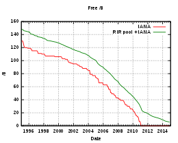

1995 年以来 IPv4 地址的损耗程度

2011 年 2 月，在 RIR 之间分配管理的各种传统地址块已分发给 RIR。

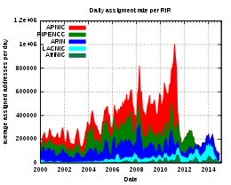

每一个 RIR 所分配到的 IPv4 地址数量

2011 年 4 月 15 日，APNIC 成为第一个用完免费分配的 IPv4 地址的区域互联网注册机构。这一日期标志着并非每个需要 IPv4 地址的人都可以分配到一个。由于这种耗尽，在 IPv6 完全实施之前，特定应用程序所需的端到端连接将无法在 Internet 上普遍可用。但是，IPv6 主机不能直接与 IPv4 主机通信，必须使用特殊的网关服务进行通信。这意味着除了新的 IPv6 地址之外，通用计算机还必须具有 IPv4 访问权限，例如通过 NAT64，这比仅支持 IPv4 或 IPv6 更加努力。预计对 IPv6 的需求将在三到四年内变得普遍。

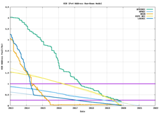

Geoff Huston 对每个 RIR 的 IP 池演变的预测

2011 年初，只有 16-26% 的计算机支持 IPv6，而只有 0.2% 的计算机更喜欢 IPv6 寻址，其中许多使用了 Teredo 隧道等过渡方法。 2011 年，前 100 万个网站中约有 0.15% 可通过 IPv6 访问。复杂的是，0.027% 到 0.12% 的访问者无法访问双栈站点，但更大比例（0.27%）的访问者无法访问纯 IPv4 站点。 IPv4 耗尽缓解技术包括用于访问 IPv4 内容的 IPv4 地址共享、IPv6 双栈实施、用于访问 IPv4 和 IPv6 寻址内容的协议转换，以及绕过单协议路由器的桥接和隧道。 IANA 用尽后 IPv6 加速采用的早期迹象很明显。

##### 区域地址耗尽

所有的 RIR 都预留了一小部分 IP 地址用于向 IPv6 的过渡（例如运营商级 NAT），每个 LIR 通常最多可以总共获得 1024 个 IP 地址。 ARIN 和 LACNIC 保留最后一个 /10 用于 IPv6 转换。 APNIC 和 RIPE NCC 为 IPv6 转换保留了最后获得的 /8 块。 AFRINIC 为此保留了一个 /11 块。当只剩下最后一个块时，RIR 的 IPv4 地址供应被称为“用尽”。

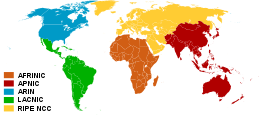

区域互联网注册机构

APNIC 是第一个限制为每个成员分配 1024 个地址的 RIR，因为其池在 2011 年 4 月 14 日达到了一个 /8 块的临界水平。APNIC RIR 负责在互联网扩展最快的领域分配地址，包括新兴的中国和印度市场。

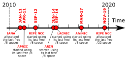

IANA 和 RIR 中 IPv4 耗尽的时间表

RIPE NCC 是欧洲的区域互联网注册机构，是 2012 年 9 月 14 日第二个耗尽其地址池的 RIR。

2014 年 6 月 10 日，拉丁美洲和加勒比地区互联网注册机构 LACNIC 成为第三个耗尽其地址池的 RIR。

ARIN 已于 2015 年 9 月 24 日用尽。自 2015 年 7 月以来，ARIN 一直无法分配大型请求，但仍在满足较小的请求。在 IANA 用尽之后，IPv4 地址空间请求在 ARIN 受到额外限制，并且在 2014 年 4 月达到最后一个 /8 后变得更加严格。

2017 年 4 月 21 日，AFRINIC 成为最后一个耗尽其最后一个 /8 块 IPv4 地址 (102/8) 的区域互联网注册机构，从而触发了其 IPv4 耗尽政策的最后阶段。 Geoff Huston 曾预计 AFRINIC 将达到 /11 块剩余水平，标志着 2018 年上半年的枯竭，但在 2019 年预测这一事件预计在 2020 年发生。

2019 年 11 月 25 日，RIPE NCC 宣布它已“从我们可用池中最后剩余的地址中进行最终的 /22 IPv4 分配。我们现在已经用完了 IPv4 地址。” RIPE NCC 将继续分配 IPv4 地址，但仅限于“来自已停业或关闭的组织，或来自返回不再需要的地址的网络。这些地址将根据他们的位置分配给我们的成员 (LIR)在新的等候名单上……”该公告还呼吁支持实施 IPv6 推出。

##### APNIC RIR 耗尽和 LIR 耗尽的影响

由于 APNIC 耗尽，需要洲际连接的系统将不得不处理耗尽缓解问题。在 APNIC，当现有 LIR 使用分配给他们的分配空间的 80% 以上时，他们可以在用尽之前申请 12 个月的库存。自 2011 年 4 月 15 日，即 APNIC 到达其最后一个 /8 块之日起，每个（当前或未来）成员将只能获得一次 1024 个地址（一个 /22 块）的分配。正如右侧“Geoff Huston 对每个 RIR 的 IP 池演变的预测”图表中 APNIC 池线的斜率所示，如果没有此政策，最后一个 /8 块将在一个月内被清空。根据 APNIC 政策，每个当前或未来的成员只能从最后一个 /8 接收一个 /22 块（最后一个 /8 块中有 16384 个 /22 块）。由于目前有大约 3000 个 APNIC 成员，并且每年大约有 300 个新的 APNIC 成员，APNIC 预计这最后一个 /8 块将持续很多年。自从重新分配回收空间以来，APNIC 将根据要求向每个成员分配额外的 /22。

/22 块中的 1,024 个地址可供 APNIC 成员用于提供 NAT44 或 NAT64 作为 IPv6 网络上的服务。然而，在一个新的大型 ISP 中，由于每个 IPv4 地址可用的端口数量有限，1,024 个 IPv4 地址可能不足以为所有客户提供 IPv4 连接。

亚洲 (APNIC) 和北美地区互联网注册管理机构 (RIR) 制定了一项称为 Inter-RIR IPv4 地址转移政策的政策，该政策允许将 IPv4 地址从北美转移到亚洲。 ARIN 政策于 2012 年 7 月 31 日实施。

已建立 IPv4 代理业务以促进这些转移。

#### 推进措施

在 2000 年代初期，对 IPv4 地址完全耗尽时间的估计差异很大。 2003 年，Paul Wilson（APNIC 主任）表示，根据当时的部署率，可用空间将持续一到二十年。 2005 年 9 月，思科系统公司的一份报告表明，可用地址池将在 4 到 5 年内耗尽。在用尽前的最后一年，IPv4 分配正在加速，导致用尽趋势提前。

- 2007 年 5 月 21 日，美国互联网号码注册机构 (ARIN)、美国、加拿大和一些岛国（主要是加勒比海地区）的 RIR 通知互联网社区，由于预计 2010 年将用尽，“对于需要从 ARIN 持续获得连续 IP 编号资源的任何应用程序，迁移到 IPv6 编号资源是必要的”。 “应用程序”包括 Internet 上设备之间的一般连接，因为某些设备仅分配了 IPv6 地址。
- 2007 年 6 月 20 日，拉丁美洲和加勒比互联网地址注册机构 (LACNIC) 建议在 2011 年 1 月 1 日之前“为 IPv6 准备其区域网络”，以“在三年内”用尽 IPv4 地址。
- 2007 年 6 月 26 日，亚太网络信息中心 (APNIC)，即太平洋和亚洲 RIR，批准了日本网络信息中心 (JPNIC) 的声明，即继续扩展和发展互联网，朝着建议使用基于 IPv6 的 Internet。考虑到 2010 年左右的预期耗尽，这将对 Internet 造成很大的限制。
- 2007 年 10 月 26 日，Réseaux IP Européens 网络协调中心 (RIPE NCC)，即欧洲、中东和中亚部分地区的 RIR，批准了 RIPE 社区的一份声明，敦促“将 IPv6 的广泛部署提高到一个高度。所有利益攸关方的优先事项”。
- 2009 年 4 月 15 日，ARIN 致函所有已分配 IPv4 地址的公司的 CEO/高管，通知他们 ARIN 预计 IPv4 空间将在未来两年内耗尽。
- 2009 年 5 月，RIPE NCC 启动了 IPv6ActNow.org，以帮助解释“每个人都能理解的 IPv6，并提供旨在促进 IPv6 全球采用的各种有用信息”。
- 2009 年 8 月 25 日，ARIN 宣布在加勒比地区举办联合系列活动，以推动 IPv6 的实施。 ARIN 此时报告说，剩余的 IPv4 地址空间不到 10.9%。
- 世界 IPv6 日是由互联网协会和几家大型内容提供商赞助和组织的测试公共 IPv6 部署的活动。它于 2011 年 6 月 8 日 00:00 UTC 开始，并于同一天 23:59 结束。该测试主要包括发布 AAAA 记录的网站，允许支持 IPv6 的主机使用 IPv6 连接到这些站点，并纠正错误配置的网络。
- 世界 IPv6 发布日于 2012 年 6 月 6 日举行，此前一年世界 IPv6 日取得了成功。它涉及更多的参与者，并有一个更雄心勃勃的目标，即在参与者组织的网络上永久启用 IPv6。
- 2015 年 9 月 24 日，ARIN 宣布 ARIN IPv4 地址池用尽。
- 2019 年 11 月 25 日，RIPE NCC 宣布已“从我们可用池中最后剩余的地址中进行最终的 /22 IPv4 分配”。
- 2020 年 8 月 21 日，LACNIC 宣布已完成最终的 IPv4 分配。

#### IPv4 耗尽时代应对措施

到 2008 年，对耗尽时代的政策规划正在进行中。为了延缓 IPv4 地址的短缺，已经讨论了几项提议：

##### 回收未使用的 IPv4 空间

在仍然使用分类网络设计作为分配模型之前和期间，大量的 IP 地址被分配给一些组织。由于使用 CIDR，互联网号码分配机构 (IANA) 可能会收回这些范围并以更小的块重新发布地址。ARIN、RIPE NCC 和 APNIC 有一个传输策略，这样地址可以被返回，使用目的是重新分配给特定的收件人。但是，重新编号大型网络的成本和时间可能会很昂贵，因此这些组织可能会反对，并可能产生法律冲突。但是，即使所有这些都被回收，也只会导致地址耗尽的日期推迟。

类似地，IP 地址块已分配给不再存在的实体，并且某些已分配的 IP 地址块或其中大部分从未使用过。没有对 IP 地址分配进行严格的核算，并且需要大量的努力来追踪哪些地址真正未被使用，因为许多地址仅在 Intranet 上使用。

IANA 之前保留的一些地址空间已添加到可用池中。已经有人提议使用 IPv4 地址的 E 类网络范围（这将向可用池中添加 2.684 亿个 IP 地址），但许多计算机和路由器操作系统和固件不允许使用这些地址。出于这个原因，这些提案试图不将 E 类空间指定为公共分配，而是建议允许将其私有用于需要比当前通过 RFC 1918 可用的更多地址空间的网络。

一些组织已返回大量 IP 地址。值得注意的是，斯坦福大学在 2000 年放弃了其 A 类 IP 地址块，提供了 1600 万个 IP 地址。其他已经这样做的组织包括美国国防部、BBN Technologies 和 Interop。

##### 建立 IP 地址市场

建立买卖 IPv4 地址的市场被认为是解决 IPv4 稀缺问题的一种方法，也是一种重新分配的手段。 IPv4 地址市场的主要好处是它允许买家保持本地网络功能不受干扰。 IPv6 的采用虽然在进行中，但目前仍处于早期阶段。它需要大量的资源投入，并且存在与 IPv4 不兼容的问题，以及一定的安全和稳定性风险。

- IPv4 地址市场的创建只会在相对较短的时间内延迟 IPv4 地址空间的实际枯竭，因为公共互联网仍在增长。
- ARIN 和 RIPE NCC 政策文件以及 ARIN 注册服务协议明确否认 IP 地址作为财产的合法所有权的概念，尽管所有权是根据美国国家科学基金会总法律顾问的一封信提出的。 NSF 后来表示该观点并非官方观点，随后商务部发表声明称“美国政府参与制定并支持互联网技术社区通过以下方式达成的政策、流程和程序“
- 地址的临时交易可能导致路由模式的碎片化，这可能会增加全局路由表的大小，从而可能导致路由内存资源不足的路由器出现问题。
  微软在 Addrex 促成的交易中以 750 万美元的价格从 Nortel 的清算出售中购买了 666,624 个 IPv4 地址。
- 在用尽之前，Microsoft 可以免费从 ARIN 获得地址，前提是根据 ARIN 政策，Microsoft 可以向 ARIN 提出对它们的需求。此次转让的成功取决于微软成功地向 ARIN 提出了这样的理由。此次购买为 Microsoft 提供了足以满足其声称的未来 12 个月增长需求的供应，而不是 ARIN 通常要求的 3 个月期限。

##### 过渡机制

随着 IPv4 地址池的耗尽，一些 ISP 将无法向客户提供全球可路由的 IPv4 地址。然而，客户可能需要访问 IPv4 Internet 上的服务。已经开发了几种技术来通过 IPv6 接入网络提供 IPv4 服务。

在 ISP 级别的 IPv4 NAT 中，ISP 可以在其网络内实现 IPv4 网络地址转换，并将私有 IPv4 地址分配给客户。这种方法可以让客户继续使用现有的硬件。一些对 NAT 的估计认为，美国 ISP 的 IP 数量是他们为现有客户提供服务所需的 IP 数量的 5-10 倍。

然而，分配给客户的私有 IPv4 地址可能与客户网络上的私有 IP 分配冲突。此外，一些 ISP 可能必须将其网络划分为子网，以允许它们重用私有 IPv4 地址，从而使网络管理复杂化。还有人担心消费级 NAT 的功能（例如 DMZ、STUN、UPnP 和应用程序级网关）可能在 ISP 级别不可用。 ISP 级 NAT 可能会导致多级地址转换，这可能会使用于在专用网络中运行 Internet 服务器的端口转发等技术的使用进一步复杂化。

NAT64 将来自客户端的 IPv6 请求转换为 IPv4 请求。这避免了向客户端提供任何 IPv4 地址的需要，并允许仅支持 IPv6 的客户端访问 IPv4 资源。但是，此方法需要具有 DNS64 功能的 DNS 服务器，并且不能支持仅 IPv4 的客户端设备。

DS-Lite (Dual-Stack Light) 使用从客户端设备到 ISP 的网络地址转换器的隧道。消费端设备将 IPv4 数据包封装在 IPv6 包装器中，并将它们发送到称为 AFTR 元素的主机。 AFTR 元素在将数据包发送到公共 Internet 之前对数据包进行解封装并执行网络地址转换。 AFTR 中的 NAT 在其 NAT 映射表中使用客户端的 IPv6 地址。这意味着不同的客户端可以使用相同的私有 IPv4 地址，因此无需为客户分配私有 IPv4 IP 地址或使用多个 NAT。

地址加端口允许基于 TCP/UDP 端口号的公共 IP 地址的无状态共享。每个节点都分配有 IPv4 地址和要使用的端口号范围。其他节点可能被分配相同的 IPv4 地址，但端口范围不同。该技术避免了网络核心中对有状态地址转换机制的需求，从而使最终用户能够控制自己的地址转换。

##### 长期解决方案

IPv6 的部署是解决 IPv4 地址短缺问题的基于标准的解决方案。 IPv6 得到所有互联网技术标准机构和网络设备供应商的认可和实施。 它包含许多设计改进，包括将 32 位 IPv4 地址格式替换为 128 位地址，从而在可预见的未来提供无限制的寻址空间。 自 2006 年 6 月起，IPv6 一直处于积极的生产部署中，此前在 6bone 项目中组织的全球测试和评估已停止。 仅使用 IPv4 协议的主机的互操作性是通过各种 IPv6 转换机制实现的。

#### 部署

自 2000 年代中期以来，最新一代 Internet 协议的 Internet 协议版本 6 (IPv6) 的部署一直在进行。

IPv6 被设计为 IPv4 的替代品。 IPv4 自 1982 年以来一直在使用，并且处于耗尽其未分配地址空间的最后阶段，但仍承载着大部分 Internet 流量。谷歌的统计数据显示，截至 2022 年 4 月，其用户的 IPv6 可用性约为 34-38%，具体取决于一周中的哪一天（周末更多）。各国和互联网服务提供商的采用情况参差不齐。许多国家的使用率为 0%，而少数国家的使用率超过 50%，例如印度和德国。 2016 年 11 月，互联网 1,519 个顶级域 (TLD) 中有 1,491 个 (98.2%) 支持 IPv6 访问其域名服务器，1,485 个 (97.8%) 区域包含 IPv6 粘合记录，大约 900 万个域 (4.6 %) 在他们的区域中有 IPv6 地址记录。在全球 BGP 路由表中的所有网络中，29.2% 的网络支持 IPv6 协议。

到 2011 年，个人计算机和服务器系统上使用的所有主要操作系统都实现了生产质量的 IPv6。随着移动电话服务继续从 3G 过渡到 4G 技术，蜂窝电话系统为 Internet 协议设备提供了广阔的部署领域，其中语音被提供为 IP 语音 (VoIP) 服务。 2009 年，美国蜂窝运营商 Verizon 发布了在其 4G 网络上运行的设备的技术规范。该规范根据 3GPP 第 8 版规范（2009 年 3 月）强制要求 IPv6 操作，并弃用 IPv4 作为可选功能。

### 优势

在 Internet 上，数据以网络数据包的形式传输。 IPv6 指定了一种新的数据包格式，旨在最大限度地减少路由器对数据包头的处理。 由于 IPv4 报文和 IPv6 报文的报头明显不同，因此这两种协议不能互操作。 但是，大多数传输层和应用层协议只需很少或不需要更改即可在 IPv6 上运行。 例外是嵌入 Internet 层地址的应用程序协议，例如文件传输协议 (FTP) 和网络时间协议 (NTP)，其中新的地址格式可能会导致与现有协议语法发生冲突。

#### 更大的地址空间

IPv6 相对于 IPv4 的主要优势在于其更大的地址空间。 IPv6 地址的大小为 128 位，而 IPv4 为 32 位。因此地址空间有 2128 = 340,282,366,920,938,463,463,374,607,431,768,211,456 个地址（约 3.4×1038）。该空间的某些块和某些特定地址保留用于特殊用途。

虽然这个地址空间非常大，但 IPv6 设计者的意图并不是确保可用地址的地理饱和度。相反，较长的地址简化了地址的分配，实现了有效的路由聚合，并允许实现特殊的寻址功能。在 IPv4 中，开发了复杂的无类域间路由 (CIDR) 方法以充分利用小地址空间。 IPv6 中子网的标准大小是 264 个地址，大约是整个 IPv4 地址空间大小的 40 亿倍。因此，在 IPv6 中，实际地址空间利用率会很小，但通过大子网空间和分层路由聚合提高了网络管理和路由效率。

#### 多播

多播，即在一次发送操作中将数据包传输到多个目的地，是 IPv6 基本规范的一部分。在 IPv4 中，这是一个可选的（尽管通常实现）功能。 IPv6 多播寻址具有与 IPv4 多播相同的特性和协议，但也通过消除对某些协议的需要来提供更改和改进。 IPv6 没有实现传统的 IP 广播，即使用特殊的广播地址将数据包传输到附加链路上的所有主机，因此没有定义广播地址。在 IPv6 中，通过将数据包发送到地址为 ff02::1 的链路本地所有节点多播组来实现相同的结果，这类似于 IPv4 多播到地址 224.0.0.1。 IPv6 还提供了新的多播实现，包括在 IPv6 多播组地址中嵌入集合点地址，这简化了域间解决方案的部署。

在 IPv4 中，一个组织甚至很难获得一个全球可路由的多播组分配，而且跨域解决方案的实现是晦涩难懂的。本地 Internet 注册机构为 IPv6 分配的单播地址至少具有 64 位路由前缀，从而产生 IPv6 中可用的最小子网大小（也是 64 位）。通过这样的分配，可以将单播地址前缀嵌入到 IPv6 多播地址格式中，同时仍提供 32 位块、地址的最低有效位或大约 42 亿个多播组标识符。因此，IPv6 子网的每个用户自动拥有一组可全局路由的特定源的多播组，用于多播应用程序。

IPv6 的多播结构

#### 无状态地址自动配置 (SLAAC)

IPv6 主机会自动配置自己。每个接口都有一个自行生成的本地链路地址，当连接到网络时，会执行冲突解决，并且路由器通过路由器通告提供网络前缀。路由器的无状态配置可以通过特殊的路由器重新编号协议来实现。必要时，主机可以通过动态主机配置协议版本 6 (DHCPv6) 或手动配置静态地址来配置额外的有状态地址。

与 IPv4 一样，IPv6 支持全球唯一的 IP 地址。 IPv6 的设计旨在通过淘汰网络地址转换，重新强调网络设计的端到端原则，该原则最初是在早期 Internet 建立期间构想的。因此，网络上的每个设备都可以直接从任何其他设备全局寻址。

一个稳定的、唯一的、全球可寻址的 IP 地址将有助于跨网络跟踪设备。因此，此类地址是移动设备（例如笔记本电脑和手机）的一个特殊隐私问题。为了解决这些隐私问题，SLAAC 协议包括通常称为“隐私地址”或更准确地说是“临时地址”的内容，编入 RFC 4941，“IPv6 中无状态地址自动配置的隐私扩展”。临时地址是随机且不稳定的。典型的消费设备每天都会生成一个新的临时地址，一周后会忽略发往旧地址的流量。 Windows 自 XP SP1、macOS 自 (Mac OS X) 10.7、Android 自 4.0 和 iOS 自 4.3 版默认使用临时地址。 Linux 发行版对临时地址的使用各不相同。

为具有不同路由前缀的新连接提供商重新编号现有网络是 IPv4 的一项主要工作。然而，对于 IPv6，更改少数路由器宣布的前缀原则上可以重新编号整个网络，因为主机标识符（地址的最低有效 64 位）可以由主机独立自行配置。

SLAAC 地址生成方法依赖于实现。 IETF 建议地址是确定性的，但在语义上是不透明的。

#### IP 协议安全 (IPsec)

Internet 协议安全性 (IPsec) 最初是为 IPv6 开发的，但首先在 IPv4 中得到广泛部署，并对其进行了重新设计。 IPsec 是所有 IPv6 协议实施的强制性部分，并且建议使用 Internet 密钥交换 (IKE)，但在 RFC 6434 中，将 IPsec 包含在 IPv6 实施中被降级为建议，因为要求所有类型的完整 IPsec 实施被认为是不切实际的 可能使用 IPv6 的设备。 但是，从 RFC 4301 开始，实现 IPsec 的 IPv6 协议实现需要实现 IKEv2 并且需要支持最少的加密算法集。 这一要求将有助于使 IPsec 实现在来自不同供应商的设备之间更具互操作性。 IPsec 身份验证标头 (AH) 和封装安全负载标头 (ESP) 实现为 IPv6 扩展标头。

#### 简化路由

IPv6 中的数据包标头比 IPv4 标头简单。许多很少使用的字段已移至可选的标题扩展。使用简化的 IPv6 数据包头，路由器转发数据包的过程得到了简化。尽管 IPv6 数据包标头的大小至少是 IPv4 数据包标头的两倍，但在某些情况下，路由器处理仅包含基本 IPv6 标头的数据包可能更有效，因为由于标头对齐，路由器中需要的处理更少以匹配常见的单词大小。然而，许多设备在软件（而不是硬件）中实现 IPv6 支持，从而导致非常糟糕的数据包处理性能。此外，对于许多实施方式，扩展标头的使用会导致数据包由路由器的 CPU 处理，从而导致性能不佳甚至安全问题。

此外，IPv6 标头不包括校验和。 IPv4 标头校验和是针对 IPv4 标头计算的，每次生存时间（在 IPv6 协议中称为跳数限制）减一时，路由器都必须重新计算。 IPv6 标头中没有校验和进一步推进了 Internet 设计的端到端原则，该原则设想网络中的大多数处理都发生在叶节点中。假定对封装在 IPv6 数据包中的数据的完整性保护由链路层或高层协议中的错误检测来保证，即传输控制协议 (TCP) 和用户数据报协议 (UDP)层。因此，虽然 IPv4 允许 UDP 数据报头没有校验和（在头字段中用 0 表示），但 IPv6 要求 UDP 头中有校验和。

IPv6 路由器不执行 IP 分段。 IPv6 主机需要执行路径 MTU 发现、执行端到端分段或发送不大于默认最大传输单元 (MTU)（即 1280 个八位字节）的数据包。

#### 流动性

与移动 IPv4 不同，移动 IPv6 避免了三角路由，因此与原生 IPv6 一样高效。 IPv6 路由器还可以允许整个子网移动到新的路由器连接点而无需重新编号。

#### 扩展头

IPv6 数据包标头的最小大小为 40 个八位字节（320 位）。 选项作为扩展实现。 这为将来扩展协议提供了机会，而不会影响核心数据包结构。 但是，RFC 7872 指出，一些网络运营商在穿越传输自治系统时会丢弃带有扩展标头的 IPv6 数据包。

#### Jumbograms

IPv4 将数据包限制为 65,535 ($2^{16}-1$) 个八位字节的有效负载。 IPv6 节点可以选择处理超过此限制的数据包，称为 jumbograms，它可以大到 4,294,967,295 ($2^{32}-1$) 个八位字节。 使用 jumbograms 可以提高高 MTU 链路的性能。 Jumbograms 的使用由 Jumbo Payload Option 扩展标头指示。

### 数据包

IPv6 数据包是使用 Internet 协议版本 6 (IPv6) 交换的最小消息实体。数据包由用于寻址和路由的控制信息以及用户数据的有效载荷组成。 IPv6 数据包中的控制信息被细分为强制的固定报头和可选的扩展报头。 IPv6 数据包的有效负载通常是更高级别传输层协议的数据报或段，但也可能是互联网层（例如 ICMPv6）或链路层（例如 OSPF）的数据。

IPv6 数据包通常通过链路层（即通过以太网或 Wi-Fi）传输，链路层将每个数据包封装在一个帧中。当使用 6to4 或 Teredo 转换技术时，数据包也可以通过更高层的隧道协议传输，例如 IPv4。

与 IPv4 相比，路由器不会对大于最大传输单元 (MTU) 的 IPv6 数据包进行分段，这是始发节点的唯一责任。 IPv6 要求最小 MTU 为 1,280 个八位字节，但“强烈建议”主机使用路径 MTU 发现以利用大于最小值的 MTU。

自 2017 年 7 月起，互联网号码分配机构 (IANA) 负责注册 IPv6 数据包标头中使用的所有 IPv6 参数。

#### 固定头

固定报头开始一个 IPv6 数据包，大小为 40 个八位字节（320 位）。

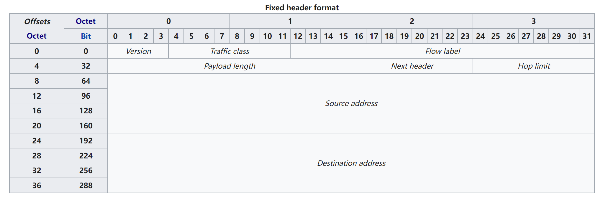

固定头格式

- **版本（4 位）**
  常数 6（位序列 0110）。

- **流量等级（6+2 位）**
  该字段的位包含两个值。六个最高有效位保存区分服务字段（DS 字段），用于对数据包进行分类。目前，所有标准 DS 字段都以“0”位结束。任何以两个“1”位结尾的 DS 字段都旨在供本地或实验使用。
  其余两位用于显式拥塞通知（ECN）；优先级值细分为范围：源提供拥塞控制的流量和非拥塞控制流量。

- **流标签（20 位）**

  源和目标之间的数据包流的高熵标识符。流是一组数据包，例如 TCP 会话或媒体流。特殊的流标签 0 表示数据包不属于任何流（使用此方案）。较旧的方案通过源地址和端口、目标地址和端口、协议（最后一个 Next Header 字段的值）来识别流。还建议使用流标签来帮助检测欺骗性数据包。

- **有效载荷长度（16 位）**

  有效负载的大小（以八位字节为单位），包括任何扩展标头。当 Hop-by-Hop 扩展标头带有 Jumbo Payload 选项时，长度设置为零。

- **下一个标头（8 位）**

  指定下一个标头的类型。该字段通常指定数据包有效负载使用的传输层协议。当数据包中存在扩展头时，该字段指示跟随哪个扩展头。这些值与用于 IPv4 协议字段的值共享，因为这两个字段具有相同的功能（请参阅 IP 协议编号列表）。

- **跳数限制（8 位）**

  替换 IPv4 中的生存时间字段。该值在每个转发节点减 1，如果它变为 0，则丢弃该数据包。但是，即使接收到跳数限制为 0，目标节点也应正常处理该数据包。

- **源地址（128 位）**

  发送节点的单播 IPv6 地址。

- **目标地址（128 位）**

  目标节点的 IPv6 单播或多播地址。

为了提高性能，并且由于假设当前的链路层技术和传输层协议能够提供足够的错误检测，报头没有校验和来保护它。

#### 拓展头

扩展头携带可选的互联网层信息，并放置在固定头和上层协议头之间。扩展标头使用 Next Header 字段形成一个链。固定头中的 Next Header 字段表示第一个扩展头的类型；最后一个扩展头的 Next Header 字段指示了数据包有效载荷中上层协议头的类型。所有扩展头的大小都是 8 个八位字节的倍数；一些扩展头需要内部填充来满足这个要求。

定义了几个扩展头，将来可能会定义新的扩展头。大多数扩展标头在数据包的目的地进行检查和处理。 Hop-by-Hop Options 可以由中间节点处理和修改，如果存在，必须是第一个扩展。所有扩展标头都是可选的，最多应出现一次，但 Destination Options 标头扩展除外，它可能出现两次。

如果节点不能识别特定的扩展头，它应该丢弃数据包并发送参数问题消息（ICMPv6 类型 4，代码 1）。

下面定义的扩展标头按首字母顺序列出，以用于固定标头后面有多个扩展标头的情况。

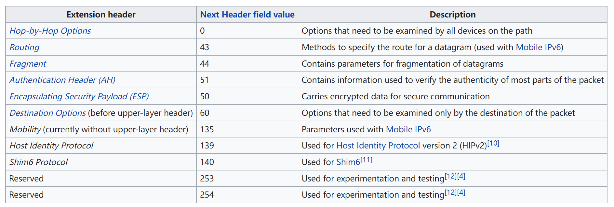

下一个标头字段中的值 59（无下一个标头）表示在此之后没有任何下一个头，甚至没有上层协议的头。 这意味着，从报头的角度来看，IPv6 数据包在它之后结束：有效负载应该是空的。 但是，如果数据包的第一个报头中的有效负载长度大于数据包中所有扩展报头的长度，则有效负载中可能仍有数据。 这些数据应该被主机忽略，但不会被路由器改变。

##### 逐跳选项和目的选项

数据包路径上的所有节点（包括发送节点和接收节点）都可以检查和更改逐跳选项扩展标头。 （对于身份验证，可能会沿路径更改的选项值将被忽略。）目标选项扩展标头仅需要由目标节点检查。 扩展标头的大小都至少为 8 个八位字节； 如果存在的选项多于该空间的容量，则包含选项和填充的 8 个八位字节的块将重复添加到标题中，直到表示所有选项。

- **下一个标头（8 位）**

  指定下一个标头的类型。

- **标头扩展长度（8 位）**

  此标头的长度以 8 字节为单位，不包括前 8 个字节。

- **选项和填充（变量）**

  包含一个或多个选项，以及用于对齐选项并使总标头长度为 8 个八位字节的倍数的可选填充字段。 选项是 TLV 编码的。

##### 路由

路由扩展标头用于在将数据包发送到其目的地之前将数据包定向到一个或多个中间节点。 标头的大小至少为 8 个八位字节； 如果需要的特定于类型的数据多于 4 个八位字节，则将 8 个八位字节的块重复添加到标题中，直到放置所有特定于类型的数据。

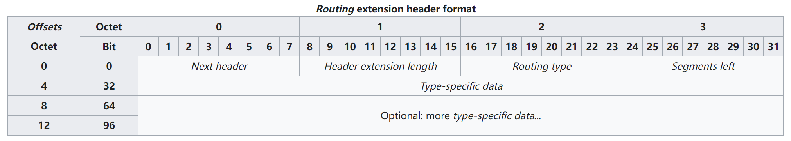

- **下一个标头（8 位）**

  指示下一个标头的类型。

- **标头扩展长度（8 位）**

  此标头的长度，以 8 个八位字节的倍数表示，不包括前 8 个八位字节。

- **路由类型（8 位）**

  一个介于 0 和 255 之间的值，由 IANA 分配。

  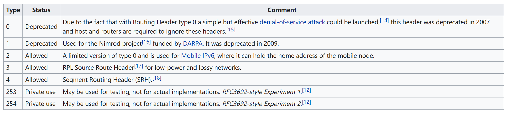

- **预留段（8 位）**

  此数据包在到达其最终目的地之前仍需访问的节点数。

- **特定类型数据（不定）**

  属于此类路由标头的数据。

##### 分段

为了发送大于路径 MTU 的数据包，发送节点将数据包拆分为多个片段。 片段扩展头携带重组原始（未分片）数据包所需的信息。

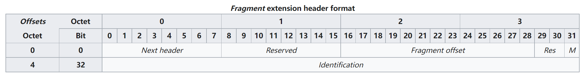

- **下一个标头（8 位）**

  标识下一个标头的类型。

- **保留（8 位）**

  初始化为全零。

- **片段偏移量（13 位）**

  偏移量，以 8 字节为单位，相对于原始数据包的可分段部分的开始。

- **分辨率（2 位）**

  预订的; 初始化为零。

- **M 标志（1 位）**

  1 表示后面有更多片段； 0 表示最后一个片段。

- **标识（32 位）**

  数据包标识值，由源节点生成。 需要重新组装原始数据包。

#### 负载

固定和可选的 IPv6 报头之后是上层有效载荷，即传输层提供的数据，例如 TCP 段或 UDP 数据报。 最后一个 IPv6 报头的 Next Header 字段指示此数据包中包含的有效负载类型。

##### 标准有效载荷长度

IPv6（和 IPv4）的有效载荷长度字段的大小为 16 位，能够为有效载荷指定最大长度为 65535 个八位字节。 在实践中，主机使用路径 MTU 发现来确定最大可用有效负载长度（沿从发送者到接收者的路径产生最小 MTU），以避免必须对数据包进行分段。 大多数链路层协议的 MTU 远小于 65535 个八位字节。

##### 报文

IPv6 的一个可选功能，即 Hop-By-Hop Options 扩展标头中的 jumbo payload 选项，通过使用 一个 32 位长度的字段。 具有此类有效负载的数据包称为 jumbograms。

由于 TCP 和 UDP 都包含限制为 16 位的字段（长度、紧急数据指针），因此对 IPv6 jumbograms 的支持需要对传输层协议实现进行修改。 Jumbograms 仅与 MTU 大于 65583 个八位字节的链路相关（超过 65535 个八位字节的有效载荷，加上 40 个八位字节的固定报头，加上 8 个八位字节的逐跳扩展报头）。 只有少数链路层协议可以处理大于 65535 个八位字节的数据包。

@Todo 可以翻译更多内容@

@Ref [IPv6 packet - Wikipedia](https://en.wikipedia.org/wiki/IPv6_packet)@

### 寻址

IPv6 地址有 128 位。 IPv6 地址空间的设计实现了与 IPv4 不同的设计理念，其中使用子网划分来提高小地址空间的利用效率。 在 IPv6 中，地址空间在可预见的未来被认为足够大，本地子网始终使用 64 位作为地址的主机部分，指定为接口标识符，而最高有效 64 位用作路由 字首。 虽然关于无法扫描 IPv6 子网的神话已经存在，但 RFC 7707 指出，某些 IPv6 地址配置技术和算法产生的模式允许在许多实际场景中进行地址扫描。

#### 地址表示

IPv6 地址的 128 位表示为 8 组，每组 16 位。每个组都写成四个十六进制数字（有时称为十六进制或更正式的十六进制，非正式地称为小问题或四半字节），并且这些组由冒号 (:) 分隔。这种表示的一个例子是 2001:0db8:0000:0000:0000:ff00:0042:8329。

为了方便和清楚起见，IPv6 地址的表示可以用以下规则来缩短。

- 从任何一组十六进制数字中删除一个或多个前导零，这通常对所有前导零进行。例如，组 0042 转换为 42。
- 零的连续部分替换为两个冒号 (::)。这只能在一个地址中使用一次，因为多次使用会使地址不确定。 RFC 5952 要求不要使用双冒号来表示省略的单个零部分。

这些规则的应用示例：

- 初始地址：2001:0db8:0000:0000:0000:ff00:0042:8329。
- 删除每组中的所有前导零后：2001:db8:0:0:0:ff00:42:8329。
- 省略连续的零部分后：2001:db8::ff00:42:8329。

环回地址 0000:0000:0000:0000:0000:0000:0000:0001 在 RFC 5156 中定义，并使用两个规则缩写为 ::1。

由于 IPv6 地址可能有多个表示形式，IETF 已发布了一个提议的标准来以文本形式表示它们。

因为 IPv6 地址包含冒号，并且 URL 使用冒号来分隔主机和端口号，所以 RFC2732 规定用作 URL 的主机部分的 IPv6 地址应该用方括号括起来，例如 http://[2001:db8:4006:812::200e] 或 http://[2001:db8:4006:812::200e]:8080/path/page.html。

#### 本地链接

IPv6 主机的所有接口都需要链路本地地址，其前缀为 fe80::/10。 该前缀与一个 64 位后缀结合在一起，主机可以自行计算和分配该前缀，而无需外部网络组件（如 DHCP 服务器）的存在或合作，在称为链路本地地址自动配置的过程中。

链路本地地址（后缀）的低 64 位最初源自底层网络接口卡的 MAC 地址。 由于这种分配地址的方法在更换有故障的网卡时会导致不需要的地址更改，并且由于它还存在许多安全和隐私问题，RFC 8064 已将原始的基于 MAC 的方法替换为指定的基于哈希的方法 RFC 7217。

#### 唯一性

IPv6 使用一种将 IP 地址映射到链路层地址（MAC 地址）的新机制，因为它不支持广播寻址方法，而 IPv4 中的地址解析协议 (ARP) 的功能正是基于该方法。 IPv6 在链路层实现邻居发现协议（NDP，ND），它依赖于 ICMPv6 和多播传输。： 210  IPv6 主机通过发送邻居请求消息来验证其 IPv6 地址在局域网 (LAN) 中的唯一性为 IP 地址的链路层地址。如果 LAN 中的任何其他主机正在使用该地址，它就会响应。

启动新 IPv6 接口的主机首先使用旨在生成唯一地址的几种机制之一生成唯一的链路本地地址。如果检测到非唯一地址，主机可以使用新生成的地址重试。一旦建立了唯一的本地链路地址，IPv6 主机将确定 LAN 是否在此链路上连接到任何支持 IPv6 的路由器接口。它通过向所有路由器多播组发送 ICMPv6 路由器请求消息来实现此目的，并将其链路本地地址作为源。如果在预定次数的尝试后没有应答，主机断定没有路由器连接。如果它确实从路由器得到响应（称为路由器通告），则该响应包括网络配置信息以允许建立具有适当单播网络前缀的全局唯一地址。还有两个标志位告诉主机是否应该使用 DHCP 来获取更多信息和地址：

- 管理位，指示主机是否应该使用 DHCP 来获取额外的地址，而不是依赖路由器通告中的自动配置地址。
- Other 位，指示主机是否应通过 DHCP 获取其他信息。其他信息包括主机所连接的子网的一个或多个前缀信息选项、前缀的生命周期和两个标志：
  - On-link：如果设置了这个标志，主机将把特定子网上的所有地址都视为在线，并直接向它们发送数据包，而不是在给定的生命周期内将它们发送到路由器。
  - 地址：这个标志告诉主机实际创建一个全局地址。

#### 网际寻址

全局地址的分配过程类似于本地地址的构造。 前缀由网络上的路由器通告提供。 多个前缀公告会导致配置多个地址。

无状态地址自动配置 (SLAAC) 需要 /64 地址块，如 RFC 4291 中所定义。本地 Internet 注册中心至少分配有 /32 块，它们在从属网络之间划分。 最初的建议声明将 /48 子网分配给最终消费者站点 (RFC 3177)。 这被 RFC 6177 所取代，它“建议为主站点提供显着多于单个 /64，但也不建议为每个主站点提供 /48”。 /56s 被特别考虑。 ISP 是否会遵守这一建议还有待观察。 例如，在最初的试验中，康卡斯特的客户获得了一个单一的 /64 网络。

@Todo 可以添加更多内容@

@Ref [IPv6 address - Wikipedia](https://en.wikipedia.org/wiki/IPv6_address)@

### 域名解析系统

在域名系统 (DNS) 中，主机名通过 AAAA（“quad-A”）资源记录映射到 IPv6 地址。对于反向解析，IETF 保留了域 ip6.arpa，其中名称空间由 IPv6 地址的半字节单元（4 位）的 1 位十六进制表示分层划分。该方案在 RFC 3596 中定义。

双栈主机查询 DNS 服务器解析完全限定域名（FQDN）时，主机的 DNS 客户端发送两个 DNS 请求，一个查询 A 记录，另一个查询 AAAA 记录。主机操作系统可以配置有地址选择规则 RFC 6724 的首选项。

在 IPv6 的早期 DNS 实施中使用了另一种记录类型，旨在促进网络重新编号、用于正向查找的 A6 记录以及许多其他创新，例如位串标签和 DNAME 记录。它在 RFC 2874 及其参考文献中定义（在 RFC 3364 中进一步讨论了两种方案的优缺点），但已被弃用为实验状态（RFC 3363）。

### 迁移至 IPv6 的过渡机制

预计 IPv6 不会立即取代 IPv4。 两种协议将继续同时运行一段时间。 因此，需要 IPv6 过渡机制，使 IPv6 主机能够访问 IPv4 服务，并允许孤立的 IPv6 主机和网络通过 IPv4 基础设施相互访问。

根据 Silvia Hagen 的说法，在设备上实现 IPv4 和 IPv6 的双栈是迁移到 IPv6 的最简单方法。 许多其他转换机制使用隧道将 IPv6 流量封装在 IPv4 网络中，反之亦然。 这是一个不完美的解决方案，它降低了链路的最大传输单元 (MTU)，因此使路径 MTU 发现复杂化，并可能增加延迟。

#### IP 双栈

双栈 IP 实现在通用物理层实现（例如以太网）之上的计算机或网络设备的操作系统中提供完整的 IPv4 和 IPv6 协议栈。这允许双栈主机同时参与 IPv6 和 IPv4 网络。该方法在 RFC 4213 中定义。

在操作系统中实现双栈的设备具有 IPv4 和 IPv6 地址，并且可以使用 IPv4 或 IPv6 与 LAN 或 Internet 中的其他节点通信。两种 IP 协议都使用域名系统 (DNS) 协议来解析完全限定域名 (FQDN) 和 IP 地址，但双栈要求解析 DNS 服务器可以解析这两种类型的地址。这种双栈 DNS 服务器将在 A 记录中保存 IPv4 地址，在 AAAA 记录中保存 IPv6 地址。根据要解析的目标，DNS 名称服务器可能会返回 IPv4 或 IPv6 IP 地址，或两者都返回。需要在主机或 DNS 服务器上配置默认地址选择机制或首选协议。 IETF 发布了 Happy Eyeballs 来协助双栈应用程序，以便它们可以使用 IPv4 和 IPv6 进行连接，但如果可用的话，更喜欢 IPv6 连接。但是，双栈也需要在主机和 DNS 服务器已为其返回 IPv6 地址的服务之间的所有路由器上实现。如果网络能够使用 IPv6 版本的路由协议转发 IPv6 数据包，则应仅将双栈客户端配置为首选 IPv6。当双栈网络协议到位时，应用层可以迁移到 IPv6。

虽然主要操作系统和网络设备供应商支持双栈，但传统网络硬件和服务器不支持 IPv6。

#### 面向公网

互联网服务提供商 (ISP) 越来越多地为其企业和私人客户提供面向公众的 IPv6 全球单播地址。但是，如果在局域网 (LAN) 中仍然使用 IPv4，并且 ISP 只能提供一个面向公众的 IPv6 地址，则使用 NAT64 将 IPv4 LAN 地址转换为面向公众的 IPv6 地址，这是一种网络地址转换 (NAT ） 机制。一些 ISP 无法为其客户提供面向公众的 IPv4 和 IPv6 地址，从而支持双栈组网，因为一些 ISP 已经用尽了其全球可路由的 IPv4 地址池。同时，ISP 客户仍在尝试访问 IPv4 网络服务器和其他目的地。

在所有区域互联网注册 (RIR) 区域中，很大一部分 ISP 已获得 IPv6 地址空间。这包括世界上许多主要的 ISP 和移动网络运营商，例如 Verizon Wireless、StarHub Cable、Chubu Telecommunications、Kabel Deutschland、Swisscom、T-Mobile、Internode 和 Telefónica。

虽然一些 ISP 仍然只为客户分配 IPv4 地址，但许多 ISP 只为其客户分配 IPv6 或双栈 IPv4 和 IPv6。 ISP 报告称，来自客户的 IPv6 流量在其网络上的份额在 20% 到 40% 之间，但到 2017 年年中，IPv6 流量仍然只占几个大型互联网交换点 (IXP) 总流量的一小部分。 AMS-IX 报告为 2%，SeattleIX 报告为 7%。 2017 年的一项调查发现，许多由双栈 ISP 提供服务的 DSL 客户并未请求 DNS 服务器将完全限定的域名解析为 IPv6 地址。调查还发现，来自支持 IPv6 的网络服务器资源的大部分流量仍然通过 IPv4 请求和服务，主要是由于 ISP 客户没有使用其 ISP 提供的双栈设施，而在较小程度上是由于客户仅限 IPv4 的 ISP。

IANA、RIR 和 ISP 的 IPv6 前缀分配机制

#### 隧道

RFC 4213 概述了隧道技术或将 IPv6 数据包封装在 IPv4 数据包中的技术基础。当 Internet 骨干网仅支持 IPv4 时，常用的隧道协议之一是 6to4。 Teredo 隧道还经常用于将 IPv6 LAN 与 IPv4 Internet 骨干网集成。 Teredo 在 RFC 4380 中进行了概述，通过将 IPv6 数据包封装在 UDP 中，允许 IPv6 局域网在 IPv4 网络上建立隧道。 Teredo 中继是在 Teredo 服务器和本地 IPv6 网络之间进行调解的 IPv6 路由器。 在 ISP 网络切换到原生 IPv6 之前，预计 6to4 和 Teredo 将被广泛部署，但到 2014 年，谷歌统计数据显示，这两种机制的使用率几乎下降到 0。

#### IPv6 映射

混合双栈 IPv6/IPv4 实现识别一类特殊的地址，即 IPv4 映射的 IPv6 地址。这些地址通常使用标准 IPv6 格式的 96 位前缀编写，其余 32 位使用 IPv4 的习惯点十进制表示法编写。

与 IPv4 兼容的 IPv6 单播地址

该组中的地址由 80 位前缀的 0 组成，接下来的 16 位是 1，其余的最低有效 32 位包含 IPv4 地址。例如 ::ffff:192.0.2.128 表示 IPv4 地址 192.0.2.128。以前的格式，称为“与 IPv4 兼容的 IPv6 地址”，是 ::192.0.2.128；但是，此方法已被弃用。

IPv4 映射的 IPv6 单播地址

由于 IPv4 和 IPv6 协议栈之间存在显着的内部差异，因此 IPv6 栈中程序员可用的一些较低级别的功能在与 IPv4 映射地址一起使用时无法正常工作。一些常见的 IPv6 堆栈没有实现 IPv4 映射地址功能，要么是因为 IPv6 和 IPv4 堆栈是独立的实现（例如，Microsoft Windows 2000、XP 和 Server 2003），要么是因为安全问题（OpenBSD）。在这些操作系统上，程序必须为它使用的每个 IP 协议打开一个单独的套接字。在某些系统上，例如 Linux 内核、NetBSD 和 FreeBSD，此功能由套接字选项 IPV6_V6ONLY 控制。： 22

地址前缀 64:ff9b::/96 是一类嵌入 IPv4 的 IPv6 地址，用于 NAT64 转换方法。例如，64:ff9b::192.0.2.128 表示 IPv4 地址 192.0.2.128。

### 安全性

使用 IPv6 可能会产生许多安全隐患。 其中一些可能与 IPv6 协议本身有关，而另一些可能与实现缺陷有关。

#### 影子网络

添加软件制造商默认启用 IPv6 的节点可能会导致无意中创建影子网络，从而导致 IPv6 流量流入仅具有 IPv4 安全管理的网络。 这也可能发生在操作系统升级时，当较新的操作系统默认启用 IPv6，而较旧的操作系统则没有。 未能更新安全基础设施以适应 IPv6 可能会导致 IPv6 流量绕过它。 影子网络已经出现在企业网络中，企业将默认情况下没有启用 IPv6 堆栈的 Windows XP 系统替换为启用了 IPv6 堆栈的 Windows 7 系统。 因此，一些 IPv6 堆栈实施者建议禁用 IPv4 映射地址，而在需要同时支持 IPv4 和 IPv6 的情况下使用双堆栈网络。

#### 数据包分片

研究表明，可以利用分片来规避网络安全控制，类似于 IPv4。 因此，RFC 7112 要求 IPv6 数据包的第一个片段包含整个 IPv6 标头链，从而禁止一些非常病态的分片情况。 此外，作为 RFC 7113 中对 RA-Guard 规避的研究结果，RFC 6980 已弃用通过 Neighbor Discovery 使用分段，并不鼓励使用 Secure Neighbor Discovery (SEND) 使用分段。

### RFC 标准化

#### 提案

由于 Internet 的预期全球增长，Internet 工程任务组 (IETF) 在 1990 年代初期开始努力开发下一代 IP 协议。： 209  到 1992 年初，出现了一些关于扩展 Internet 寻址系统的提案到 1992 年底，IETF 宣布了对白皮书的呼吁。 1993 年 9 月，IETF 创建了一个临时的、临时的 IP Next Generation (IPng) 区域来专门处理此类问题。新领域由 Allison Mankin 和 Scott Bradner 领导，并有一个由 15 名来自不同背景的工程师组成的董事会，负责制定方向和初步审查文件：工作组成员包括 J. Allard (Microsoft)、Steve Bellovin (AT&T)、 Jim Bound (Digital Equipment Corporation), Ross Callon (Wellfleet), Brian Carpenter (CERN), Dave Clark (MIT), John Curran (NEARNET), Steve Deering (Xerox), Dino Farinacci (Cisco), Paul Francis (NTT), Eric Fleischmann (波音)、Mark Knopper (Ameritech)、Greg Minshall (Novell)、Rob Ullmann (Lotus) 和 Lixia Zhang (Xerox)。

互联网工程任务组于 1994 年 7 月 25 日采用了 IPng 模型，并成立了几个 IPng 工作组。到 1996 年，一系列 RFC 发布，定义了 Internet 协议版本 6 (IPv6)，从 RFC 1883 开始。（实验性 Internet 流协议使用版本 5。）

IPv6 标准的时间表

#### 标准化历史

第一个标准化 IPv6 的 RFC 是 1995 年的 RFC 1883，它在 1998 年被 RFC 2460 淘汰。： 209  2017 年 7 月，该 RFC 被 RFC 8200 取代，后者将 IPv6 提升为“互联网标准”（IETF 的最高成熟度级别） 协议）。

### 部署现状

1993 年在 Internet 的路由和 IP 地址分配中引入无类域间路由 (CIDR)，以及网络地址转换 (NAT) 的广泛使用，延迟了 IPv4 地址耗尽以允许 IPv6 部署，这始于中期-2000 年代。

大学是 IPv6 的早期采用者之一。弗吉尼亚理工大学于 2004 年在试验地点部署了 IPv6，后来在整个校园网络中扩展了 IPv6 部署。到 2016 年，他们网络上 82% 的流量使用 IPv6。伦敦帝国理工学院于 2003 年开始实验性 IPv6 部署，到 2016 年，其网络上的 IPv6 流量平均在 20% 到 40% 之间。这种 IPv6 流量的很大一部分是通过他们与 CERN 的高能物理合作产生的，这完全依赖于 IPv6。

域名系统 (DNS) 从 2008 年开始支持 IPv6。同年，IPv6 首次在北京 2008 年夏季奥运会期间的一项重大世界赛事中使用。

到 2011 年，个人计算机和服务器系统上使用的所有主要操作系统都实现了生产质量的 IPv6。随着移动电话服务从 3G 过渡到 4G 技术，蜂窝电话系统为 Internet 协议设备提供了广阔的部署领域，其中语音被提供为利用 IPv6 增强功能的 IP 语音 (VoIP) 服务。 2009 年，美国蜂窝运营商 Verizon 发布了在其“下一代”网络上运行的设备的技术规范。该规范根据 3GPP 第 8 版规范（2009 年 3 月）强制要求 IPv6 操作，并弃用 IPv4 作为可选功能。

IPv6 在 Internet 骨干网中的部署仍在继续。 2018 年，大约 54,000 个自治系统中只有 25.3% 在全球边界网关协议 (BGP) 路由数据库中同时发布了 IPv4 和 IPv6 前缀。另有 243 个网络仅发布 IPv6 前缀。除了非洲、中东和中国的部分地区外，全球每个国家/地区都存在提供 IPv6 支持的 Internet 骨干传输网络。： 6  到 2018 年年中，一些主要的欧洲宽带 ISP 已为其大多数客户部署了 IPv6。 Sky UK 为其 86% 以上的客户提供 IPv6，Deutsche Telekom 有 56% 的 IPv6 部署，荷兰的 XS4ALL 有 73% 的部署，比利时的宽带 ISP VOO 和 Telenet 分别有 73% 和 63% 的 IPv6 部署。： 7 在美国，宽带 ISP Comcast 的 IPv6 部署率约为 66%。 2018 年，康卡斯特报告的 IPv6 用户估计为 3610 万，而 AT&T 报告的 IPv6 用户为 2230 万。

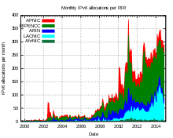

每个地区互联网注册机构 (RIR) 的每月 IPv6 分配

## IPv6 应用案例

@Todo 工业、高校部署内容@

@Ref 必应搜索 IPv6 规模部署案例 site:gov.cn@

### 中国人民银行 IPv6 规模部署和应用案例

#### 工作背景及目标

人民银行认真贯彻党中央、国务院战略部署，针对金融业 IPv6 规模部署和应用实施“基数大、分布广”的特点，坚持问题导向、目标导向，多措并举推动金融业全面开展相关工作。

#### 主要做法经验

**（一）强化组织，统筹谋划**

一是全面统筹组织金融业 IPv6 规模部署工作，横向与银保监会、证监会等联合成立 IPv6 规模部署专项工作组；纵向将推进 IPv6 规模部署工作纳入对人民银行分支机构年度考核，逐级夯实主题责任，通过“横纵贯通”机制，形成监管合力。二是结合金融机构工作实际，将 IPv6 改造相关指标纳入金融业网络安全和信息化“十四五”规划，并召开金融业深入推进 IPv6 规模部署与应用工作交流会，明确下一阶段工作要求、重点任务、工作目标，系统推进金融业 IPv6 规模部署与应用。

**（二）创新引领，组织试点**

一是深入调研部分金融机构互联网基础软硬件设施情况、互联网应用现状、IPv6 改造重点和难点等，组织工商银行、上海银行等金融机构开展互联网应用 IPv6 改造部署试点，总结细化 IPv6 改造各项工作任务清单。二是联合银保监会、证监会有关部门组织金融机构开展 IPv6 技术创新和融合应用试点申报，按照优中选优、精益求精、整合资源、重点突破的原则，推荐改造成效好、技术实力强的金融机构创新试点项目，深入发掘 IPv6 技术潜能和创新空间，培育 IPv6 应用新业态。

**（三）行业引导，标准先行**

一是加强行业自律与经验交流，凝聚产学研用各方力量，探索健全 IPv6 监控运维体系，推动 IPv6 关键技术联合攻关，降低行业 IPv6 改造整体成本。二是发挥标准创新引领作用，推动多项行业标准研制，为金融业 IPv6 规模部署与应用提供标准保障，提升金融机构推进 IPv6 改造的规范化、专业化水平。

**（四）科学监测，精准实施**

一是制定金融行业 IPv6 规模部署技术验证指标，形成科学统一的监测体系；二是建设金融业 IPv6 发展监测平台，为金融机构全面客观掌握并验证改造情况提供科学量化标准，精准引导金融机构落地实施规模部署。

**（五）加强监督，检查落实**

一是联合银保监会、证监会有关部门组织开展金融业 IPv6 规模与应用专项摸排，即时通报金融机构 IPv6 改造情况，鼓励先进、鞭策后进。二是建立金融机构 IPv6 改造定期报告制度，及时跟踪改造数据、全面评估改造成效，督促金融机构按时保质完成改造目标与任务。

#### 工作成效与亮点

**（一）IPv6 改造完成率持续提升**

目前，金融业 IPv6 规模部署与应用实施工作进展迅速，成效明显。截至 2021 年底，金融机构门户网站 IPv6 支持率超过 90%，面向公众服务的互联网应用 IPv6 支持率超过 80%；月活跃用户在 100 万以上的 APP 超过 85%，月活跃用户在 1000 万以上的 APP 超过 90%。

**（二）IPv6 深入创新应用不断涌现**

金融业 IPv6 关键技术创新、应用创新持续突破，应用范围和场景不断扩展，广域网等重点领域 IPv6 应用更加深入。金融领域 10 多个项目获评 IPv6 规模部署和应用优秀案例，体现了金融业 IPv6 演进升级和创新引用工作成果，带动了金融机构高质量实施 IPv6 规模部署和应用。

**（三）IPv6 关键技术和标准研究取得突破**

完成基于 SRv6 的金融广域网技术研究报告，为金融机构开展广域网 IPv6+SDN 升级改造提供可借鉴的经验做法。基于行业发展现状和国家部署要求，修订完善移动金融客户端应用软件相关要求，编制金融业 IPv6 改造相关技术标准，进一步规范金融机构 IPv6 规模部署工作。

**（四）IPv6 改造评估认证取得新进展**

探索引入第三方认证，按照自愿申请原则，为金融机构开展 IPv6 改造评估认证，以标准规范为依据，助力金融机构提升 IPv6 改造的规范性、安全性、稳定性。

### 腾讯 IPv6 规模部署和应用案例

#### 概述

2017 年底，中共中央办公厅、国务院办公厅联合印发《推进互联网协议第六版（IPv6）规模部署行动计划》，明确提出“用 5 到 10 年时间，形成下一代互联网自主技术体系和产业生态，建成全球最大规模的 IPv6 商业应用网络，实现下一代互联网在经济社会各领域深度融合应用，成为全球下一代互联网发展的重要主导力量”的目标。随后中央网信办、工业和信息化部连续三年发文推动 IPv6 改造工作，鼓励和支持国内用户量排名前 100 位的商业网站及应用支持 IPv6 接入。

#### 案例描述

##### 案例介绍

QQ 邮箱自 2002 年上线，其依托于腾讯集团及腾讯云强大的基础网络能力，向用户提供安全、稳定、快速、便捷的电子服务。自推出服务以来，因其简洁易用，良好的用户体验，深受广大用户喜爱，目前已成为中国大陆最受欢迎的免费邮箱服务产品。

##### 架构设计

- GSLB 提供 DNS 以及 httpdns 解析，为用户返回最近的接入点。
- TGW 作为统一接入网关，实现多网统一接入以及自动负载均衡。
- PROXY 提供逻辑层的功能路由。
- LOGIC 提供邮箱各项功能及服务。

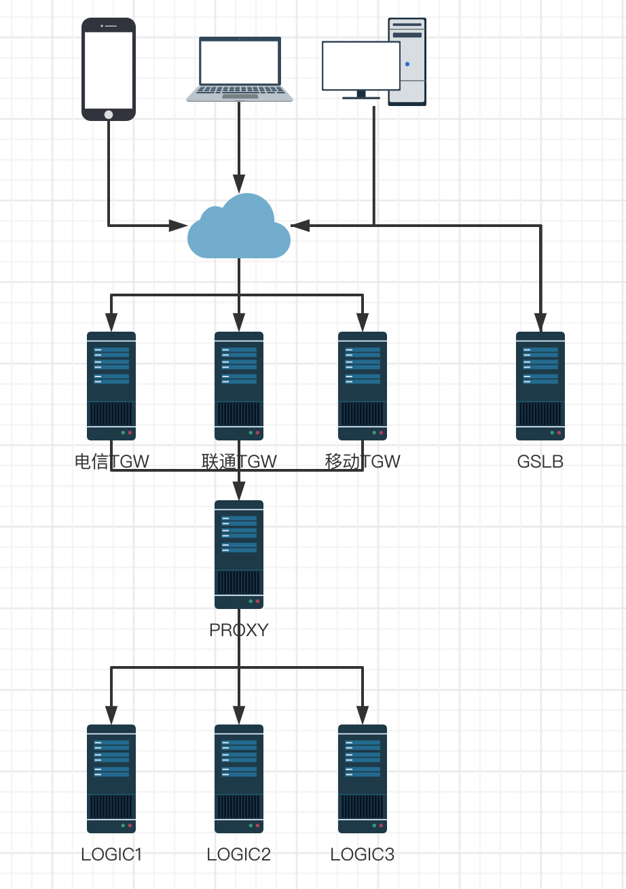

QQ邮箱总体架构图

##### 实施方案

QQ 邮箱的改造主要包括以下几个部分：支持 AAAA 记录、双栈改造、客户端改造、PROXY 及 LOGIC 改造，其中 GSLB 作为最基础的流量调度，是此次改造最基础的部分。

**支持 AAAA 记录**

用户访问互联网的服务一般都是使用域名，在 IPv6 到来的时代，如何将域名转换成对应的 IPv6 地址，DNS 的 AAAA 记录发挥着重要作用。

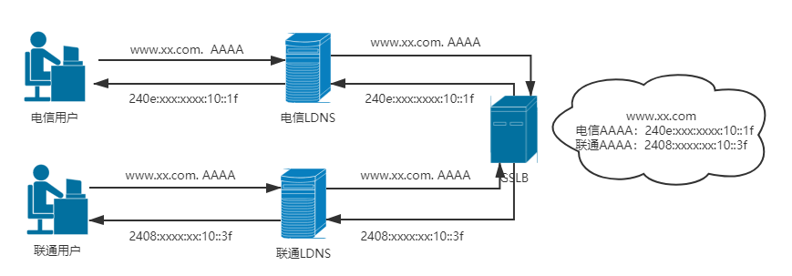

用户请求域名AAAA记录示意图

AAAA 解析实际上并不能完全实现 IPv6 时代业务流量的精准调度，此时的 GSLB 权威还是只支持 IPv4 链路的请求，对于用户使用 IPv6 链路过来的请求到达不了 GSLB 的权威服务器，那么接下来需要做的就是对 GSLB 进行双栈改造。

**双栈改造**

双栈改造主要涉及到两个部分，一个是 GSLB 权威双栈的开发，另一个则是 GSLB 权威双栈的灰度上线。

**开发部分**

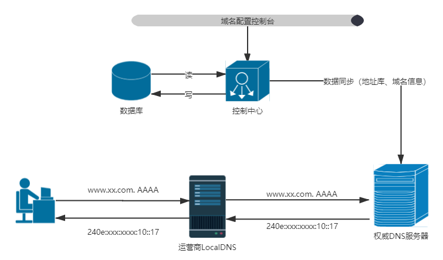

GSLB权威示意图

对于 GSLB 权威双栈的开发，主要分三步走：数据的同步、双栈协议的实现、域名的解析。

1）地址库同步

在支持双栈链路之后，用户会通过 IPv6 链路访问权威服务器，那么 IPv6 地址库也就成了 GSLB 必不可少的一环。

2）双栈协议的实现

GSLB 权威服务基于 DPDK 实现，摒弃了 Linux 内核协议栈，那么在处理双栈链路请求的时候，需要自己处理 IPv4 以及 IPv6 协议，保证解析的高效和稳定。

3）域名解析

对于用户的域名请求，根据用户请求的 IP 地址或者携带的 IP 地址（ECS），判断 IP 地址的归属，然后根据 IP 对应的地址库（IPv4 查找 IPv4 的地址库，IPv6 则查找 IPv6 的地址库），查找对应的国家-省份-运营商信息，返回该域名最匹配的 RR 记录，实现双栈的流量调度。

**灰度部分**

初版 IPv6 地址库通过手工方式生成完毕，业务侧需求高涨，在此背景下，灰度上量成了最迫切的需求，如何保证双栈权威的解析系统可以正常使用，同时也保证灰度过程全程可控呢？

此时，通过上线一套独立的双栈权威解析系统，新建 testipv6.com 域名后缀授权到双栈权威，该后缀域名在控制面可以通过日常域名操作平台进行域名的增删改查操作，解析面通过支持双栈地址库同步的 agent 同步 IPv4 和 IPv6 地址库到权威服务器，对于存量业务，不更改接入域名的前提，建议业务通过小流量地区+运营商 cname 到双栈权威域名的方式进行域名解析。

**客户端的改造**

客户端改造的重点在于，用户双栈环境下，优先使用 IPv6 链路，当 IPv6 链路不通或者质量不好的情况下，可以尽快切到 IPv4 链路，保障客户端使用体验。

1）双栈下 IPv6 优先

客户端的改造重点在于保障用户接入质量的前提下完成双栈优先 IPv6 的改造要求，以及在 IPv6 单栈情况下可以直接访问接入通道。

2）失败回退

当前支持 IPv6 的用户，基本都为双栈用户，因此可以基于测速逻辑、失败重试、缓存最优接入 IP 等方式实现出现错误后回退到 IPv4。

3）灰度可控

支持基于用户 id、省份/运营商的灰度能力，保证质量可控。

**PROXY 及逻辑服务改造**

邮箱服务历史久远，邮箱服务中，有大量基于 IP 地址的逻辑，因此改造过程几乎涉及邮箱服务的所有功能模块。

改造的步骤也是先进行后端的逻辑改造，首先完成反垃圾基础频率服务、邮件身份识别等改造。同时反垃圾识别算法进行升级，避免 IPv6 流量进入后，因 IP 资源泛滥导致垃圾邮件漏过。

其次完成 PROXY 的 IPv6 地址传递，LOGIC 层 IP 的处理以及日志记录等一系列和 IP 相关的逻辑。

##### 安全及可靠性

反垃圾能力，是保证邮件服务基础体验的核心，在改造中，针对 IPv6，我们主要做了以下准备：

1）IPv6 地址库，用于判断用户登录地、运营商做异常登录判断；

2）IPv6 属性库，建议基于 IPv6 地址的画像，积累 IPv6 的行为属性特征、邮件行为特征；

3）IPv6 聚集算法，在 IPv4 时代，我们可以通过 IPC 来进行聚集。IPv6 时代，我们根据 IPv6 的分配原则以及业务上的特征，在不同的场景使用不同的聚类算法。

#### 实施效果

经过多方面的改造升级，目前 QQ 邮箱已全面上线，全部功能支持 IPv6 协议访问。对所有用户进行了 IPv6 放量支持，只要用户网络环境及终端设备支持 IPv6 协议，在使用 QQ 邮箱时即可通过 IPv6 协议来访问。在双栈环境下，IPv6 流量占比约占 87%。

### 北京度友科技有限公司 IPv6 规模部署和应用案例

#### 背景

“十三五”规划加大 IPv6 产业的推动力度，百度网盘作为领先云存储的应用，积极响应政府号召，2018 年开始实施全面 IPv6 改造工作。

#### 目标

百度网盘产品功能实现在 IPv6 单栈、IPv6 双栈网络下正常访问，双栈网络优先使用 IPv6，IPv6 网络质量波动时用户无感切换 IPv4。实现全国 31 个省（区市）全部运营商全量上线 IPv6，应用侧 IPv6 流量统计不低于 50%。

#### 案例介绍

网盘涉及多端（App 双端、PC、Web）业务非常复杂，整体改造挑战巨大。首先对全端进行实测摸底：1、IPv6 only 环境下功能是否正常；2、双栈环境下 IPv6 流量占比。从网盘整体现状出发，制定网盘 IPv6 改造的关键步骤：

1.基础网络：数据中心网络升级 IPv6/IPv4 双栈，部署 IPv6 监测环境；

2.客户端 App：网络库通信、下载、数据统计等接口支持 IPv6；

3.业务后端：用户真实 IPv6 地址传递、获取、存储接口；

4.运维监控：IPv6 监控、预案、灰度切流方案；

百度网盘系统结构

名词解释：

- BGW：百度网络接入网关，四层负载均衡

- BFE：百度统一接入前端，七层负载均衡

完整的 App 改造涉及上百个子系统，几十个技术团队的分工合作，高效率组织协同是保证项目进度的关键环节。百度 IPv6 项目成立专项推进小组，由专职项目进度经理负责推进。公共组件由基础架构团队升级，各子系统、产品线指定 IPv6 负责人分工协作。

#### 基础网络

百度基础网络由基础技术团队统一改造。如下图所示，边缘接入层负责安全防御和业务接入，云数据中心负责海量数据存储和计算。

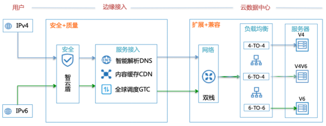

图 2 百度基础网络接入拓扑

电信、联通、移动三大运营商及教育网均支持 IPv6 线路，可在原有 IPv4 链路上配置 IPv6 开通双栈，也可单独开通 IPv6 链路。网盘改造使用前者，实施更快。

**IPv6 网络质量感知**

网盘最主要的数据下载是通过 CDN 分发，基础网络需要能准确的感知 CDN 的 IPv6 质量、覆盖率、延时数据，建设以下技术手段：IPv6 质量监控、IPv6 智能解析调度。

1. IPv6 质量监控：为流量调度、故障止损提供基础数据，是质量优化和运维稳定性的必备工具。可购买第三方监控公司的监控点、虚拟机来构建监控源，也可在自有 CDN 节点部署探测任务。在监控源上模拟 IPv4/IPv6 用户请求，将请求结果上传到数据中控。中控对访问速度、丢包率、时延、错误码等信息进行分类统计，从而产出 IPv6 质量优的（省份，运营商）组合，也能准实时告警 IPv6 网络波动。

2. IPv6 智能解析调度：流量调度的决策执行器，在用户优选访问的数据节点故障时，通过 DNS 解析将流量调度到备用节点。百度实现了故障态的 7\*24 全自动流量调度，在 IPv6 上线阶段是非常有效的容灾手段。

**负载均衡接入层**

负载均衡是流量接入的关键设备，建议单独部署一套 IPv6 的物理集群，将 IPv4 和 IPv6 隔离。负载均衡改造时需同时兼容 4to4、6to4、6to6 三种模式。

百度采用 6to4 方案，在四层负责均衡设备将用户的真实 IPv6 地址写入 TCP Options，在下游的七层负载均衡模块提取 Options 再填充到请求头的 clientipv6 字段，一路透传给下游的业务系统使用。

在改造初期需要对 IPv6 做非常多的网络监控和适配工作，不一一枚举，当前 IPv6 技术方案已比较成熟，上述提及的方案在百度云及其他云厂商已有成熟方案，可直接采用云解决方案，也可参考自行搭建。

##### 客户端改造

网盘客户端在网络库接口层支持 IPv6 协议栈，根据用户上网环境切换合适协议。

1. 域名解析优先 IPv6：全面使用 HTTP-DNS SDK，支持 IPv4 单栈、IPv6 单栈、IPv4/IPv6 双栈下的 IP 解析；

2. Happy Eyeballs：双栈下优先选取 IPv6，在 IPv6 网络连通性较差的环境能自动回退 IPv4；

3. 网络库/下载库升级：网络接口升级 IPv4/IPv6 协议，百度内部统一升级 URLSession、OKHttp 等网络库，降低开发工作量；

网盘改造过程中办公网搭建了 4 套网络验证环境：IPv4 单栈、IPv6 单栈、IPv4/IPv6 双栈，以及双栈下 IPv6 故障环境。模拟 IPv6 地址故障、DNS 解析失败等故障场景。在沙盒环境测试人员充分演练不同操作系统、客户端版本在故障态的服务表现。

##### 服务端改造

双栈下需要透传正确的用户 IP 地址给服务后端，后端服务也需要能正确处理 v6 格式 IP。网盘服务接入层行为可简要描述：

- IPv6 用户，BFE 写入 clientipv6,clientipv4 置空

- IPv4 用户，BFE 写入 clientipv4,clientipv6 置空

IPv6 用户的访问在数据中心内转成 v4 协议，在 BFE 将实际的 v6 地址写入请求头传递给下游系统。

下游子系统的升级涉及用户 IP 的获取、存储、使用等。

- IPv6 地址获取：支持从请求头读取 clientipv4 和 clientipv6 两种格式，做好空值判断处理。

- 用户 IP 存储：同时添加 IPv4 & IPv6 的存储方式，看内部需求，使用 byte 还是字符串的方式进行存储。

用户 IP 接口改造：指含有 IP 信息透传的 API，改造有两种方式，扩展和新增。扩展是对原 IPv4 的方式扩大输入的 byte 位数来兼容 IPv4 & IPv6；新增是维持原 IPv4 的接口不变，添加新基于 IPv6 的接口。

同理还有词典策略、离线计算、IPv6 日志分析等等关联系统的地址接口升级。

##### 运维监控和灰度方案

监控改造是在监控系统中区分 IPv4、IPv6 协议，面对故障能够智能告警。网盘的监控包括：域名流量、IP 连通性：

1. 域名流量监控是域名维度的异常统计，在状态码、拒绝、响应时间等指标中区分 IP 类型；

2. IP 连通性是在网络探针中区分 IPv4/IPv6 目标地址，数据中控汇聚 IPv6 探测质量；

灰度升级的目的是小流量验证，使 IPv6 切量的异常范围可控，可快速止损。结合网盘业务的业务特点，制定了分级发布原则：

1. 先对一个省份的三大运营商进行测试，全量域名在一个省份测试通过后再逐省放量。观察相应监控指标是否正常。

2. 先进行数据下载域名的上线，与 IPv4 调度保持一致，等全量数据域名上线完成，再上线控制域名。

#### 总结

百度网盘团队充分协调公司资源，加班加点进行研发和测试，积极推动兄弟部门业务改造，在有限的时间内高效地完成了单栈、双栈等复杂网络环境下的服务全面升级。团队通过对地域、运营商多维度进行流量监控的手段，和逐步放量的方式，保证了线上服务的稳定性。百度网盘团队坚持以用户利益为根本，充分运用自身技术优势，持续为用户提供更全面、稳定和安全的服务及体验。

### 中国第一汽车集团有限公司 IPv6 规模部署和应用案例

#### 案例概述

##### 背景

为贯彻落实党中央、国务院决策部署，深入推进互联网协议第六版（IPv6）规模部署和应用，根据要求，自 2018 年起中国第一汽车集团有限公司开始启动整个集团 IPv6 的网络改造工作，一汽集团数据中心作为整个一汽集团网络的核心节点首先完成了 IPv6 的网络基础设施规模部署工作。

##### 目标

优先完成国资委对企业门户网站的考核要求，完成集团及二级公司门户、生产管理系统 IPv6 的门户访问，同一域名下二三级页面 IPv6 支持度不低于 90%；

完成了数据中心网络的 IPv6 网络基础设施改造，包括互联网区、核心交换区、服务器区、测试办公区的 IPv6 网络设备实现双栈；

完成基础服务内外网域名解析的双栈访问，dhcp 服务的双栈访问。

#### 做法与经验

##### 先规划再实施

根据集团互联网区、广域网区、服务器区、核心交换区、重要园区、工厂网络环境现状，结合中国一汽业务情况和运营商情况，制定未来 3-5 年整体规划方案，数据中心网络基础设施改造是整个规划方案的第一步，包含了整个集团网络的互联网区域、广域网区域、核心交换区域、汇聚下联区。

##### 分区域设计建设

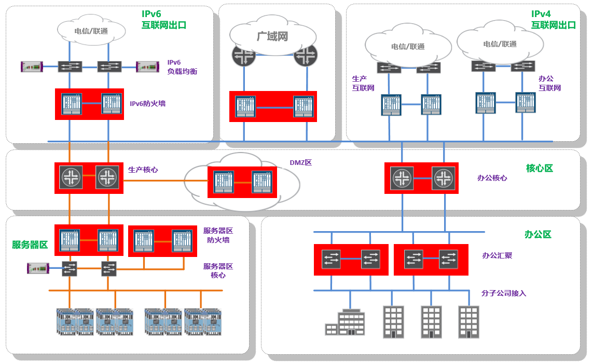

注释：如上图具体建设规划按区域进行

**互联网区：**根据上联运营商的具体情况，保持原有的 IPv4 互联网出口，建立独立的 IPv6 互联网出口，通过负载均衡实现联通、电信双运营商自动选路，设备采用双栈模式；

**广域网区：**使用双栈模式，采用 OSPFv3 动态路由选择协议同步路由，采用 VRRPv3 实现设备冗余备份；

**DMZ 区：**使用双栈模式，部署防火墙，实现 IPv6 资源访问的安全防护；

**核心交换区：**使用双栈模式，采用 OSPFv3 动态路由选择协议同步路由，采用 VRRPv3 实现设备冗余备份；

**下联区域：**采用双栈模式，此区域对接分子公司上联；

**基础服务：**dhcp、dns 支持 IPv6；

所有区域网络设备实现双栈可提供服务支持能力如下：

- 数据中心所有区域均能提供 IPv6 互访；

- 用户使用 IPv6 地址访问互联网和服务器资源；

- 互联网区可通过 IPv4/IPv6 转换技术直接对外提供业务发布。

##### 基于一汽集团目前 IPv4 的网络环境现状采用以下几种过渡方案：

地址转换：利用 IPv4/IPv6 转换技术，将 IPv4 地址和 IPv6 地址形成一一映射，该方案用于业务系统对互联网提供服务；

双栈模式：是指在终端设备和网络节点上既安装 IPv4 又安装 IPv6 的协议栈，从而实现分别与 IPv4 或 IPv6 节点间的信息互通；

独立的互联网 IPv6 出口：采用完全独立的 IPv6 互联网出口设计，完全复制 IPv4 的互联网架构可以在不影响和不中断业务的情况下快速进行 IPv6 规模部署。

##### IPv6 地址规划方案

IPv6 地址设计用于替代 IPv4 现有协议，地址长度为 128 位，有效解决了 IPv4 地址不足的问题，地址规划在整体规划方案中要先于建设规划避免日后出现地址使用时的限制和冲突。

采用内外网地址进行 NAT 转换与互联网通讯；

集团内网统一使用 IPv6 唯一本地地址作为内网私有地址；

唯一本地地址格式：FC00::/7 前 7bit 为固定值；

集团规划使用 32 位固定前缀的唯一本地地址；

根据语义化原则集团将按 8bit 为一个字段划分 32 位的网络地址分别对应组织机构标识、二级组织机构/区域标识、业务标识、业务子网；

根据可连续扩展原则集团分配给分子公司的字段上下相邻区域保留；

根据路由聚合原则分配给子公司的字段路由；

办公终端及业务系统全部使用 64 位前缀以及 64 为主机标识。

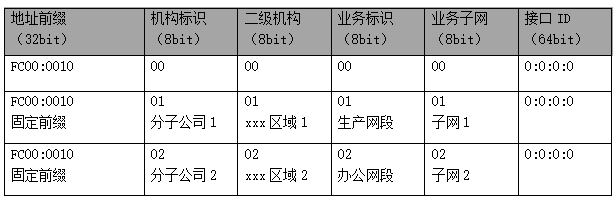

范例

##### 改造评估

集团 IPv6 改造涉及集团办公、生产核心交换机、服务器区防火墙、IPv6 出口防火墙、负载均衡等设备，从设备硬件、配置、性能、协议等多方面评估升级改造可行性。

#### 成效与亮点

##### 保质保量按时完成 IPv6 阶段性改造任务

一汽集团按照国资委要求，保质保量按时完成 IPv6 改造方案。

##### 采用成熟过渡技术手段降低对业务影响

采用成熟过渡技术手段降低对业务影响，门户网站零改动，无中断实现 IPv6 发布。

##### 整体规划集团 IP 地址资源，制定长远发展方案

通过本次改造，理清一汽集团 IPv6 地址资源清单，互联网地址资源对比 IPv4 可以做到提供集团互联网业务无限使用；

内网地址资源：改造后内网 IPv6 地址将不存在地址不够的情况，可以满足各类业务和应用的地址使用，为工业互联网、云计算、大数据、人工智能等新兴领域的业务发展提供基础。

##### 搭建完成集团网络的 IPv6 整体基础设施框架

通过本次改造完成了一汽集团整个网络的基础设施改造的核心部分，并分区域模块化改造，完成了互联网、广域网、园区网下联区域、服务器区和基础 dns/dhcp 服务的改造并具备向下延伸的接口条件，后续可按需快速向工厂和园区网络下沉，并将成熟模式复制到分子公司规模部署。

#### 总结

中国一汽 IPv6 整体规划和改造方案在实施阶段经历了一个不断试错和不断调整的过程，目前已完成数据中心网络基础设施部分的改造，提供核心网络承载能力，后续还需要进一步扩展到全网部署。希望通过这次互联网协议第六版（IPv6）规模部署和应用优秀案例征集活动取得更好的经验借鉴和方案指导，使得中国一汽在 IPv6 规模部署的过程中少走弯路。

### 北京联通 IPv6 + 5G 承载网创新实践

#### 北京联通 IPv6+5G 承载网实施背景

1.1 网络新基建带来的机遇

IP 网络是新型基础设施建设中的底层设施。通过引入大数据、AI 技术和新一代“IPv6+”协议，IP 网络正迎来从传统 IP 网络到智能 IP 网络的巨大飞跃。网信办、工信部多次发文，部署推进“IPv6+”产业进展，在《IPv6 流量提升三年专项行动计划（2021-2023 年）》的通知中提出推进 IPv6 网络及应用创新，基础电信企业、互联网企业、重点行业企业加大 IPv6 分段路由（SRv6）等“IPv6+”网络技术创新力度，加快技术研发及标准研究进度，扩大现网试点并逐步实现规模部署。北京联通充分发挥 IPv6 协议的灵活性，将 5G 承载网与下一代互联网创新技术相结合，面向新基建发展增强型的“IPv6+”5G 承载网络。

1.2 确定性时延的挑战

5G 时代是交互控制的时代，5G 网络高带宽和低时延的数据传输能力，为实时交互和控制类业务构筑基本的网络底座。特别是 5G URLLC 类业务要求承载网提供确定性、可承诺的时延保证以及高可靠的安全网络，例如电网差动保护类业务，需要毫秒级的 RTT（Round-Trip-Time，往返时间）。

#### 北京联通 IPv6+5G 承载网设计目标

2.1 北京联通网络切片设计目标

关键设计目标：

**确定性时延：**基于确定性业务的需求分配专用资源，实现时延可承诺。

**高可靠：**通过 TI-LFA FRR（Topology-Independent Loop-free Alternate Fast ReRoute）、Candidate Path、双发选收等技术实现“零”丢包。

**安全隔离：**基于各种软硬隔离技术，满足高品质业务的确定性承载及高安全业务的物理隔离要求。

**智能管控：**快速响应切片业务需求，准确提供网络资源，做到弹性扩缩容，实现网络“规、建、维、优、营”生命周期内的闭环自治。

**能力开放：**管控系统支持能力开放，拉通无线、承载和核心网域，实现从用户意图到切片业务开通的全流程打通。

2.2 北京联通网络切片方案架构

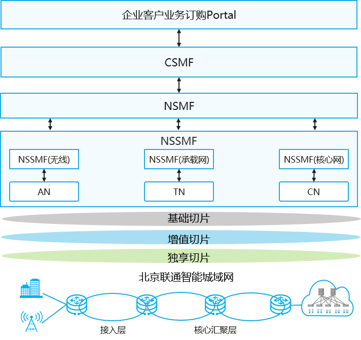

北京联通网络切片方案架构

如图所示，通过 CSMF（通信服务管理功能）、NSMF（网络切片管理功能）和 NSSMF（网络切片子网管理功能）的分解与协同，完成端到端切片网络的实例化部署：

企业客户业务订购 Portal：面向企业用户订购切片业务或者切片服务。

CSMF：负责切片服务的商品管理，用户订单管理，用户计费，将客户订购的切片服务转换成网络切片需求下发给 NSMF。

NSMF：跨域切片管理器，负责包括接入网、承载网和核心网的端到端切片的编排、创建、监控与优化。

NSSMF：子网切片管理器，一般按 AN（接入网），TN（承载网）和 CN（核心网）等子域划分，北京联通使用智能城域网控制器承担 TN-NSSMF 角色。

#### 北京联通 IPv6+5G 承载网实施方案

##### 北京联通的基线方案

北京联通针对不同业务的差异化需求以及发展节奏，在智能城域网预部署基础和增值共两个切片，预留业务级独享切片能力。基础切片承载无特殊 SLA 要求的业务，增值切片承载高价值和高 SLA 要求的业务，独享切片承载 2B 业务中对 SLA 要求极高的业务，以实现和其他任何业务绝对硬隔离。

引入 FlexE、SRv6 和 EVPN（Ethernet VPN，以太网 VPN）等技术，提供协议简化和路径可编程能力，满足业务 IPv6 化和差异化承载的诉求。引入 iFIT（In-situ Flow Information Telemetry，随流信息测量），实现随流检测业务 SLA，提升业务感知能力。引入网络控制器实现切片业务自动部署，使用 AI 加持的智能运维实现故障自动定界等特殊场景，提升网络自动化和运维智能化水平。

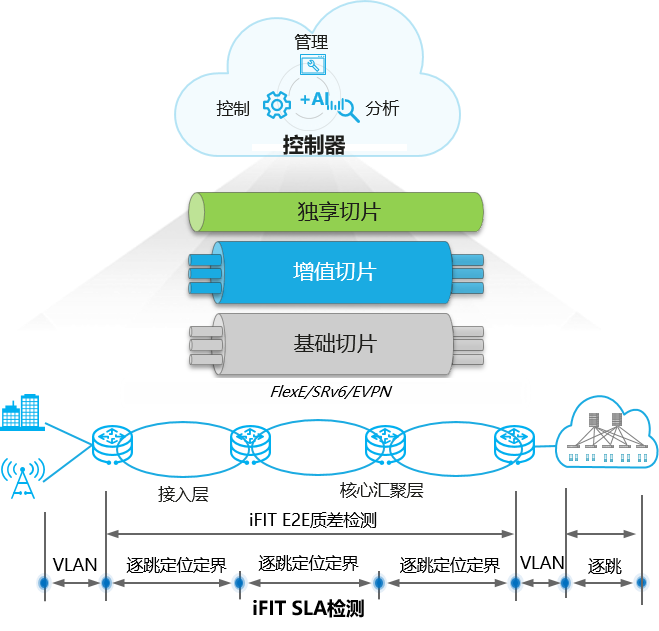

北京联通 5G 承载切片部署方案

##### 转发面

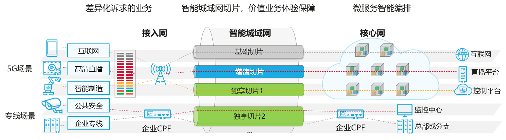

FlexE硬切片部署

全局规划两个 FlexE 硬切片，分别对应基础切片和增值切片，硬切片接口分配 IPv6 接口地址。

承载网东西向与无线、核心网对接，基于 VLAN 标识入 FlexE 硬切片，基于 DSCP 标识入 QoS（Quality of Service，服务质量）队列。

##### 控制面

IS-IS 协议开启支持 IPv6 并使用独立拓扑树。采用不同的 IS-IS 进程实例分别传递基础切片和增值切片的路由信息。

每台设备规划一个 IPv6 Loopback 地址，归属于 IS-IS 基础切片实例。PE 间基于此 IPv6 地址建立 BGP 邻居关系，不同的切片共享同一个 BGP 邻居。

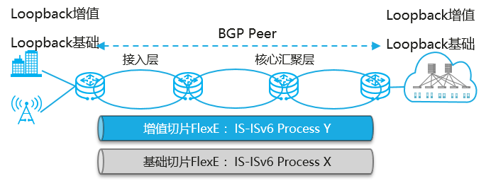

基础协议IGP/BGP部署方案

承载网隧道引入 SRv6 技术，基础切片业务用 SRv6 BE 承载，增值切片以及未来的独享切片业务用 SRv6 Policy 承载。

基础切片和增值切片分别部署 EVPN 实例，并规划不同的 Locator，归属于不同的 IS-IS 进程实例。

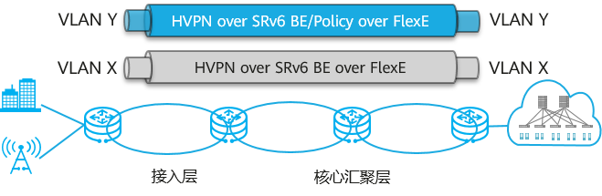

隧道和业务部署方案

设备和控制器之间建立 BGP-LS/BGP SRv6 Policy 邻居，使用 BGP-LS 上报 IGP 拓扑、FlexE 接口带宽和链路时延等信息给控制器，控制器算路结果通过 BGP SRv6 Policy 下发到转发设备。

##### 管理面

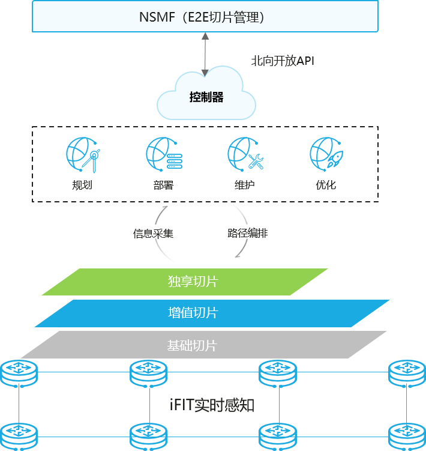

北京联通智能城域网智能管控架构

依托控制器完成切片的规划、部署、运维和优化的全生命周期流程。

切片规划：完成切片网络的物理链路、转发资源、业务 VPN 和隧道规划，指导切片网络的配置和参数设置。

切片部署：完成切片实例部署，包括创建切片接口、配置切片带宽、配置 VPN 和隧道等功能。

切片运维：完成切片网络可视、故障运维、业务自愈和根因分析等功能。

#### 北京联通 IPv6+5G 承载网应用

展望 2021 年是“十四五”开局之年，是两个百年目标交汇与转换之年，也是北京联通加快全面数字化转型、实现高质量发展新跃升的关键之年。北京联通使用“IPv6+AI+协议创新”的手段满足 5G 和云网融合业务灵活、敏捷、差异化的服务诉求，提升用户体验，实现简化网络、意图驱动和智能化运维，打造了面向 5G 和数字化时代的 IPv6+5G 承载网。

此技术方案已经在工业生产、传媒直播、安防监控等领域得到广泛的应用，也给两会、服贸会和国庆 70 周年等大型活动提供了服务。北京联通将继续以技术创新为驱动，以 5G 智能城域网为平台，深入落实“匠心网络新基建”的工程部署，打造高品质、高效能、智能化的融合承载网。

### 腾讯云 IPv6 规模部署和应用案例

#### 背景与现状

网络空间已成为国家博弈、商业竞争的新战场，以情报获取、商业牟利等为目的网络攻击活动频频发生。随着 IPv6 的推进，IPv6 流量持续增长，海量 IP 资源被用于网络攻击将加剧威胁。而传统安全运营模式一方面效率不高，另一方面分析结果严重受限于分析人员的技能和水平。这使得企业难以从海量 IPv6 网络攻击的安全事件中识别出高价值安全告警，难以及时作出响应和处理。

因此，政府、企业等组织机构亟需一种可以适配 IPv6 网络的创新型、更有效的安全运营技术体系：一方面，能够通过智能化、自动化的方式提升运营效率，有效识别新型安全风险和高级威胁；另一方面，针对新型安全风险、新型数字业务场景，能够为行业安全监管、治理提供数字化工具。

#### 技术目标

针对 IPv6 网络安全运营挑战和技术创新需求，以腾讯自身在互联网、云计算等数字业务方面的安全运营经验以及大数据处理和 AI 分析方面的技术优势为基础，以“数据驱动”和“安全智能分析”为中心构建了 IPv6 网络自适应检测阻断响应技术，形成面向政企机构的自适应安全运营体系，弹性应对新形势下的未知威胁和安全运营挑战。

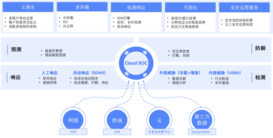

腾讯云IPv6网络自适应检测阻断安全运营体系架构图

#### 技术方案

IPv6 网络自适应检测阻断响应技术方案如下图所示。

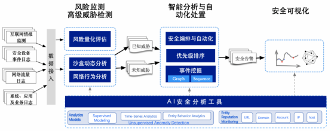

IPv6网络自适应检测阻断响应技术方案

下面将对涉及的关键技术展开介绍。

##### AI 安全分析工具——支撑智能分析的灵活扩展

针对安全运营过程中多源异构的安全数据、多业务场景的分析目标，自适应安全运营技术构建了开放式的 AI 安全分析工具包，提供封装的安全分析模型、实体信誉监测结果和共享标准化的特征数据。分析人员通过工具包中提供的分析模型，结合共享的统一特征层的数据特征，即可在无需编码开发的情况下，快速实现新的智能化安全分析场景。

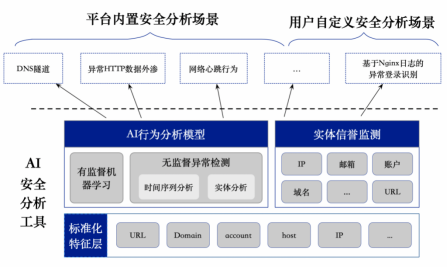

AI安全分析工具场景能力说明

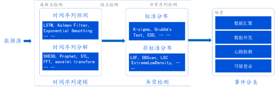

AI安全分析检测类型

##### 全面的风险监测

**面向开放的 IPv6 网络风险探测**

通过在 IPv6 网络上广泛部署蜜罐网络、分析流经蜜罐网络的流量，从中识别攻击行为与意图；基于这类开放的 IPv6 网络环境中探测、收集的风险情报能够以攻击者视角发现企业机构对外暴露的安全风险，如数据泄露、0-day 攻击。

**面向政企机构 IT 环境、业务系统的安全评估与持续监测**

通过对政府、企业等组织机构的数据中心 IPv6 网络、主机服务器、应用和服务进行安全评估，以及云环境下的配置安全风险检查，实现对机构自身的安全风险的监测。

**高级威胁检测**

本方案的高级威胁检测能力可基于 IPv6 情报进行检测，此外还提供了针对样本的沙箱动态分析能力以及面向入侵和内部威胁的行为分析能力，以实现深入、全面的威胁检测能力。

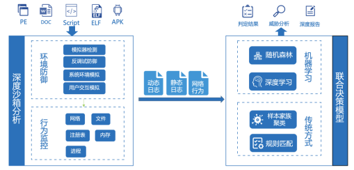

高级威胁检测能力图谱

**基于行为模式的安全分析**

针对 IPv6 网络攻击手法进行建模，通过无监督异常检测的方式构建了可疑行为模式识别能力，支持的攻击模式覆盖攻击链各个阶段，有效应对包括检测规避在内的高级攻击手法。

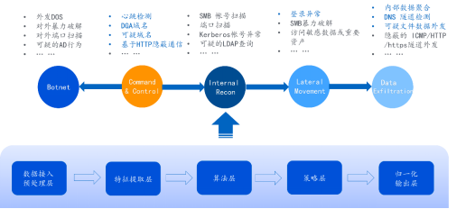

基于行为模式的安全分析

##### 智能分析与自动化处置

**AI 辅助智能化分析**

实现通过知识发现的方式从海量安全事件中找出最重要的事件集合及其内在关系，从而自动化的优先级构建和攻击上下文还原。

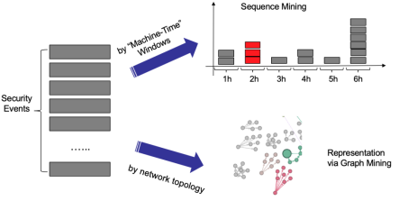

AI辅助智能化分析

**安全编排与自动化响应**

自适应安全技术方案中构建了支持安全编排和任务自动化的工作流引擎。分析人员可通过流程编排创建分析剧本，通过自动化调度，实现分析过程的自动化并联动响应阻断。

腾讯（NIPS）安全编排与自动化响应对抗秒拨场景能力

##### 安全可视化

在安全可视化方面引入了腾讯在游戏展示方面的优势，结合游戏可视化技术打造了面向安全运营的 3D 可视化技术，让用户很容易感知业务、风险和威胁情况。

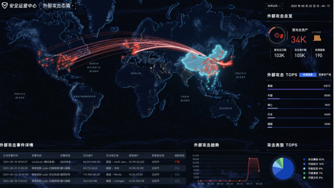

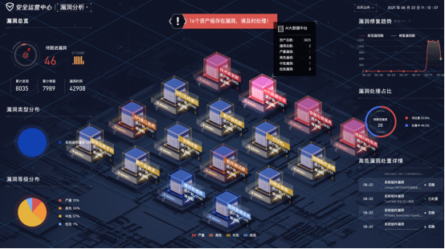

安全可视化

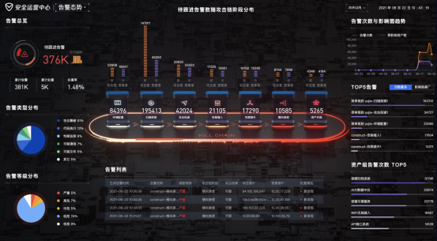

安全运营中心告警总览

##### 安全算力算法

为了应对 IPv6 时代海量数据实时计算的挑战、提升安全运营效能，本方案围绕“深入内核、贴近硬件”的技术思路，对 PaaS 层的安全算力算法进行升级。

硬件加速方面，针对 PaaS 平台的多路并行计算、超大内存吞吐等特性，深度定制硬件，在服务器层面进一步提升计算性能；代码优化方面，引入 LLvm 的 JIT 技术，优化现有的运行时编译引擎，进一步提升计算性能。同时优化 CPU 的缓存命中率，进一步提升处理性能，帮助客户形成具备万亿级海量样本、毫秒级响应等能力的安全防护体系。

#### 成效与亮点

本技术方案已在智慧城市安全运营、金融行业安全风险监管以及政企机构安全运营等场景中落地应用：

1. 助力智慧城市建设，提升城市安全运营效能

   当前智慧城市建设需求旺盛，国家对于其安全运营也提出了相应的要求。自适应安全运营技术已在长沙、贵阳、武汉、广州等城市逐步落地，为 IPv6 网络的防护保驾护航。

2. 面向政企构建全面闭环的安全运营与态势感知系统

   自 2019 年起，基于本技术方案构建的安全运营平台、网络威胁检测系统、态势感知解决方案在某大型国有银行、某大型车企等政企机构落地应用，在安全运营、IPv6 网络安全防护过程中发挥了其价值。

3. 面向金融行业构建全面闭环的安全运营与防御系统

   自 2019 年起，基于本技术方案构建的安全运营平台、网络威胁检测系统，在某大型国有银行、某大型股份制商业银行、某大型证券企业等金融机构落地应用，并成功完成国家级安全演练，在各行业中均取得前 3 名的成绩。

## IPv6 科研成果

### 使用 IPv6 的多用途全球护照解决方案

@Todo 可以添加更多内容@

@Ref [A Multipurpose global passport solution using IPv6](https://ieeexplore.ieee.org/document/5564918)@

@End Ref R. K. Murugesan and S. Ramadass, "A Multipurpose global passport solution using IPv6," 2010 3rd International Conference on Computer Science and Information Technology, 2010, pp. 405-407, doi: 10.1109/ICCSIT.2010.5564918.@

#### 概要

文章指出，建议为每个实体（尤其是人类）使用一个唯一的全球身份，用于多种目的，只需要一个 IPv6 地址来识别实体。 分配给人类实体的 IPv6 地址可用于识别个人，并与个人生物识别身份相结合，可以访问存储在分布式服务器中的文件中的个人记录。 分配给个人的 IPv6 地址可用于识别个人、访问个人的个人记录、医疗记录、定位个人、与个人通信、执行诸如银行、借记卡或信用卡设施、所得税、就业公积金等交易 基金，养老金，驾驶执照等以受控方式。

#### 结论

上述想法将为新产品、应用和服务方面的创新开辟更多机会。 它将提高运营和处理任务的效率，包括大部分日常活动和杂项活动。 上述想法还将促进 IPv6 在全球范围内扩散，最终世界上的每个实体都可以用 IPv6 地址来表示和识别，可以用于多种用途，并促进共享有益于世界的重要信息。

### 移动 IPv6 中绑定更新消息的保护

@Todo 可以添加更多内容@

@Ref [Protection of Binding Update Message in Mobile IPv6](https://ieeexplore.ieee.org/document/6410191)@

@End Ref H. Modares, A. Moravejosharieh, H. Keshavarz and R. Salleh, "Protection of Binding Update Message in Mobile IPv6," 2012 Sixth UKSim/AMSS European Symposium on Computer Modeling and Simulation, 2012, pp. 444-447, doi: 10.1109/EMS.2012.54.@

#### 概要

文章指出，移动 IPv6 (MIPv6) 中的移动节点 (MN) 有机会使用路由优化 (RO) 来消除其自身对应节点 (CN) 效率低下的三角形路由。 这大大提高了网络的性能。 不幸的是，使用这种方法会使 MIPv6 出现多个安全漏洞。 其中，常见的问题是关于 RO 过程中 Binding Update 的真实性验证和授权问题。 这些类型的未经认证和未经授权的 BU 是各种恶意攻击的关键。 由于预计 IPv6 将支持 MIPv6，因此确保 BU 安全的几种机制将在下一代互联网中至关重要。 本文重点介绍移动 IPv6 和安全注意事项。

#### 结论

考虑到一些基本问题没有得到解决，对移动 IPv6 的要求仍然不完整。最重要的问题之一是协议安全性，因为如果没有针对攻击的安全保护，协议将不会被接受，因此根本无法工作。目前，用于传输模式中的 BU 保护以及保护在归属注册期间发送的控制消息的连接的标准方法是封装安全有效载荷(ESP)。与 SSL/TLS 相比，IPSec 有几个优点，即 IPSec 可以不受 IP 限制地执行，任何协议都可以加密，也可以仅使用 IP 标头加密任何数据包。不幸的是，IPSec 需要配置各种设置，从而使其变得复杂。 IKE 协议可以控制相互认证和密码算法协商以及动态密钥管理。此外，可以使用共享密钥、可扩展身份验证协议 (EAP) 或 X.509 证书等身份验证方法来创建对等方之间的安全通信。

### 通过使用 IPv6 增强可早期部署的以内容为中心的网络

@Ref [Towards early deployable Content-Centric Networking enhanced by using IPv6](https://ieeexplore.ieee.org/document/6573162)@

@End Ref S. Ata, H. Kitamura and M. Murata, "Towards early deployable Content-Centric Networking enhanced by using IPv6," 2013 IFIP/IEEE International Symposium on Integrated Network Management (IM 2013), 2013, pp. 1191-1194.@

#### 概要

文章指出，以内容为中心的网络（CCN）有望作为未来的通信范式，无需指定节点地址即可交换内容。 但是，从零开始部署 CCN 需要很长时间，因为需要更换所有路由设施。 对于 CCN 的早期部署，尽可能使用当前的互联网基础设施，并实现对应用程序和/或终端节点的最小修改是可行的。 基于这样的背景，我们提出了一种新颖的方法，与其他方法相比，它能够以极小的修改快速部署 CCN。 我们的解决方案基于使用 IPv6 网络作为较低层的路由方案。 为了实现我们设计了一些重要的组件，例如名称映射器和地址映射器。 我们还讨论了在 IPv6 网络中早期适应 CCN 的部署方案。

#### 结论

我们通过增强现有的 IPv6 网络提出了一种新的 CCN 架构。 我们希望我们的方法对 CCN 的早期部署有所帮助。 此外，受统一复用启发的一次性地址将改善对内容的保护。 由于我们只有一个初步的实验，未来应该设计和实现更详细的功能。

### 多核平台上的 100+ Gbps IPv6 数据包转发

@Ref [100+ Gbps IPv6 packet forwarding on multi-core platforms](https://ieeexplore.ieee.org/document/6831384/)@

@End Ref T. Ganegedara and V. Prasanna, "100+ Gbps IPv6 packet forwarding on multi-core platforms," 2013 IEEE Global Communications Conference (GLOBECOM), 2013, pp. 2096-2101, doi: 10.1109/GLOCOM.2013.6831384.@

#### 概要

文章指出，随着 IPv4 地址空间的耗尽，从 IPv4 向 IPv6 寻址的迁移正在逐渐发生。这要求网络基础设施具备处理和路由 IPv6 数据包的能力。然而，随着查找操作和存储要求的复杂性增加，以线速执行 IPv6 查找具有挑战性。在这项工作中，我们提出了一种用于多核平台的高性能 IPv6 查找引擎解决方案，可提供最先进的线卡吞吐率。为了利用现代多核平台上提供的并行性，我们提出了一种路由表分区方案，该方案在给定 IPv6 路由表的情况下形成不相交和平衡的分区。这些分区表示为范围树以执行查找操作。由于所提出的分区方案的不相交性质，各个范围树能够独立运行，从而提高了查找引擎的并行性。我们在最先进的多核处理器上的实验结果表明，对于 200 万个入口 IPv6 路由表，使用所提出的方案可以实现 100+ Gbps 的吞吐量。与现有文献相比，所提出的解决方案实现了 10 倍的吞吐量，并且与硬件 IP 查找引擎提供的性能相当。

#### 结论

在这项工作中，我们提出了一种适用于现代多核平台的基于范围树的 IPv6 查找解决方案。我们设计了一种可调分区算法，该算法在给定 IPv6 路由表的情况下形成一组不相交但平衡的前缀子集。这使我们能够增强软件平台上的并行性。我们提出了两种架构，即 master-worker 和 worker-only，以显示查找引擎的不同可能配置。这两种架构在两个 AMD Opteron 6200 系列处理器上进行了评估，并测量了随机访问性能。实验结果表明，master-only 架构比 master-worker 架构具有更高的性能，这主要是由于 master-worker 架构的线程创建开销。然后对仅主机架构进行了广泛测试，结果确保了 200 万条目 IPv6 骨干路由表的 100+ Gbps 吞吐量。建议的架构可以扩展为包括增量路由表更新。路由表更新可以本地化到一个分区，因此可以更快地计算更新。

### IPv6 环境下的 WWW 服务器基准测试系统

@Ref [A WWW server benchmark system in IPv6 environment](https://ieeexplore.ieee.org/document/1210168)@

@End Ref T. Nakayama, Y. Nakamura and H. Sunahara, "A WWW server benchmark system in IPv6 environment," 2003 Symposium on Applications and the Internet Workshops, 2003. Proceedings., 2003, pp. 258-261, doi: 10.1109/SAINTW.2003.1210168.@

#### 概要

文章指出，随着 IPv6 技术的普及，我们可以使用 WWW、邮件等各种 IPv6 服务器。 因此，网络管理员应同时测量 IPv6 和 IPv4 网络和服务器。 我们讨论了在 IPv6 环境中使用的现有测量工具，考虑到 WWW 是 Internet 上最重要的服务。 我们表达了一个可以处理 IPv6 和 IPv4 的新基准系统，称为 ANMA。 我们确认 ANMA 可以通过两个协议栈正确发送请求。

#### 结论

随着 IPv6 环境的普及，需要在服务器系统的 IPv6 环境中进行测量。 我们讨论了现有测量系统在 IPv6 环境中使用 Internet 上最重要的服务 WWW 的能力。 我们发现基准系统还没有处理 IPv6。 因此，我们开发了新的基准系统，称为 ANMA，可以处理 IPv6 和 IPv4。 我们验证了 ANMA 可以通过两个协议栈正确传输请求。

我们未来的工作是使 ENMA（一个使用我们研究组开发的数据包监控的 WWW 服务器测量系统）能够处理 IPv6，并在 IPv6 环境中进一步开发测量系统。

### 在 IPv6 网络中使用 DiffServ 增强 IP QoS

@Ref [IP QoS enhancement using DiffServ in IPv6 network](https://ieeexplore.ieee.org/document/1274339)@

@End Ref H. Z. Abidin and N. Fisal, "IP QoS enhancement using DiffServ in IPv6 network," 9th Asia-Pacific Conference on Communications (IEEE Cat. No.03EX732), 2003, pp. 183-186 Vol.1, doi: 10.1109/APCC.2003.1274339.@

#### 概要

文章指出，互联网已成为当今重要的通讯工具之一。 传统的互联网，通常被描述为尽力而为的服务，主要是为数据通信应用而设计的，例如文件传输和电子邮件。 然而，当前基于 IPv4 的 Internet 不保证任何对其他交互式多媒体应用程序必不可少的特定服务质量 (QoS)。 语音和视频等应用通常被称为实时流量，它们对时间和数据包丢失很敏感。 因此，引入 IPv6 是为了改进或解决 IPv4 引起的问题。 IPv6 中的 QoS 还提供差异化服务 (DiffServ)，允许优先级调度以促进 Internet 上的多媒体通信。 本文将展示 DiffServ 如何为实时和非实时流量提供 QoS。 模拟工作是通过使用称为网络模拟器 (ns2) 的软件完成的。

#### 结论

目前，为了提高未来互联网的 QoS，进行了大量的研究和研究。 这是为了满足未来使用下一代互联网的交互式多媒体应用的需求和要求。 在这项研究中，未来的网络是使用在 IPv6 网络中实现的 DiffServ 域。 QoS 很大程度上取决于网络中采用的准入控制和调度技术。 最初的模拟工作表明，WIRR 是最好的调度方案，因为它为 EF 和 AF 流量提供了最低的端到端延迟。 理想情况下，WIRR 也被称为一种机制，可以改善其他调度程序算法（如 WRR 和 PQ）引起的问题。

我们的下一阶段将关注 WIRR 调度程序的不同呼叫准入控制 (CAC) 方法。 为 WIRR 调度程序提供最佳性能的 CAC 将在模拟中的 DiffServ 域中实现。

### 允许有效使用多家庭网络的 IPv6 网关的设计和实现

@Ref [Design and implementation of an IPv6 gateway allowing effective use of multihome network](https://ieeexplore.ieee.org/document/1235853)@

@End Ref Y. Hori, K. Onimaru, T. Ikenaga and Y. Oie, "Design and implementation of an IPv6 gateway allowing effective use of multihome network," 2003 IEEE Pacific Rim Conference on Communications Computers and Signal Processing (PACRIM 2003) (Cat. No.03CH37490), 2003, pp. 601-604 vol.2, doi: 10.1109/PACRIM.2003.1235853.@

#### 概要

文章指出，许多人将支持电气和电子设备的网络视为互联网持续增长的下一个挑战，迄今为止，这项任务一直受到 IPv4 地址空间稀缺的阻碍，而 IPv4 地址空间的稀缺导致了围绕 NAT 设计的碎片化网络。家庭联网设备取得广泛成功的另一个先决条件是支持标准应用协议，这些协议可以在不同供应商和实施之间无缝工作，并使最终客户能够设置和控制连接的设备。

将 IPv6 协议用于家庭自动化的优点是可以使用标准化的 Internet 应用程序协议与设备进行通信。它还为应用程序和设备开发人员提供了一个经过验证的分层模型，该模型有助于代码的重用并允许跨异构网络进行通信。

直到最近，更便宜、更强大的电子产品的持续趋势与对操作系统和网络协议的持续研究相结合，才使在廉价的微控制器上运行完整的 Internet 协议栈并将该设备连接到 Internet 成为可能。低功耗个人区域网络协议（例如 6LoWPAN）可以无线连接大量可以由电池供电或从其环境中获取能量的设备。

鉴于所有必要构建块的可用性，我们着手构建自己的网络连接设备，以验证这种方法的实用性。我们选择实现可通过标准 Web 浏览器操作的支持 IPv6 的门外观。对于我们的原型，我们选择了全球数百万台计算机和智能手机都可以使用的无处不在的 HTTP 协议。可以对直接安装在设备上的专用 Web 服务器进行编程以控制和操作设备。

#### 结论

在这项研究中，我们设计并实现了一个带有前缀转换机制的 IPv6 网关，并评估了它在当前 IPv6 互联网上的性能。 我们设计了一个基于最小 RTT 测量的骨干选择方案，并证明了它的有效性。 这项工作是朝着实际和有效使用支持点对点通信的站点-多家庭环境迈出的第一步，还需要进一步的广泛研究。 通过使用数据，网关可以选择合适的互联网骨干网以获得高性能，并为站点提供具有容错能力的连接。

## 合肥工业大学 IPv6

### 部署历史

#### 规划

@Ref [合肥工业大学 2010—2020 年基础能力建设规划](http://xxgk.hfut.edu.cn/2014/1004/c4642a79076/page.htm)@

在《合肥工业大学 2010—2020 年基础能力建设规划》中明确提到，在校园网建设方面，于 2010 年至 2015 年要做到：

1. 加强网络安全和网络管理设施建设，包括购置和部署高性能边界防火墙、网络入侵检测系统、网络行为审计系统、病毒防范系统、主机安全检测和隔离、身份认证系统、漏洞扫描系统等。

2. 加强校园网的高可靠性和高可用性建设，包括购置流量分析和控制、负载均衡等专用设备。

3. 无线校园网建设，规划并建设以无线局域网交换机和无线集中管理平台为基础的无线校园网，实现全校的无线覆盖。。

4. 加强和深化 IPv6 网络的建设和应用，充分发挥 IPv6 网络高带宽和高性能的特点，在全校范围内广泛开展 IPv6 服务，进行包括视频、WEB、组播等一系列基于 ipv6 的网络服务和应用。

5. 进行网络安全开放实验室的建设，为提高学校相关专业技术人员和研究生进行网络安全领域的科学研究水平、改善科学研究的实验环境提供必要的研究条件。

于 2015 年至 2020 年要做到：

1. 逐步由 IPv4 网络转向纯 IPv6 网络，为学校的信息化和数字化进程提供高速、安全的网络基础平台。

2. 进一步扩展无线网络的覆盖范围和传输带宽，逐步形成有线网络和无线网络互为补充、校园范围内可以随时随地接入的网络覆盖。

#### 研究

@Ref [214EDB63E43E9CCBB496FC0B76C_FD94C6CF_8B47.docx?e=.docx (hfut.edu.cn)](http://it.hfut.edu.cn/__local/1/3E/90/214EDB63E43E9CCBB496FC0B76C_FD94C6CF_8B47.docx?e=.docx)@

根据《信息化建设与发展中心 2017 年工作总结》，2017 年 IPv6 相关工作内容如下：

1. 提供全校 IPv4 和 IPv6 接入，做好基础设施建设工作，2017 年更新网络接入设备 210 台。配套建设、完善关键网络系统 DHCP、DNS、认证系统和电子邮件系统等。

根据《2019-2020 学年本科教学质量报告》，合肥工业大学信息化建设近状如下：

学校网络和校园卡等基础设施比较完善，全网形成了核心、汇聚和接入的三层架构， 校园网主干带宽达到 10000.0Mbps。校园网出口带宽 11900.0Mbps，基本满足学校日常管 理和教学运行需要。合肥校区几乎所有建筑物均已接入校园网，拥有 104 个 IPv4 C 类地 址，出口总带宽 15.4G，其中 IPv4 出口 5.4G，IPv6 出口 10G，铺设各类光缆超过 100Km， 开通的信息点达到 31,000 余个，网络用户超过 35,000，学校电子邮件系统用户超过 26000 个。合肥校区已无线骨干网络已建设完成，安装无线 AP 设备 1860 个，合肥校区图书馆、 会议中心及主要行政办公场所已实现无线覆盖。

宣城校区通过广域网加速隧道模式，实现与合肥校区的流畅互联，保障了图书馆数 字资源、学校行政办公及其他校内资源的无障碍内网访问。宣城校区拥有独立的校园网 出口，网络用户超过 12,000，出口带宽达到了 6.5G，开通的信息点达到了 20,000 余个。 实现教学区域、学生生活区域以及公共活动区域的无线网络全覆盖。

学校建成云计算平台并投入实际运行，承载面向全校的各类教学、管理与服务的业 务系统。目前已开通虚拟服务器 340 台，存储 160T，有力地支持了学校各部门的信息化 建设；数字化校园基础支撑平台提供日常管理、系统集成和数据交换服务，平台累计集 成业务系统 46 套，访问量达 1224 万人次；网上办事大厅开通线上服务 23 个，访问量达 2 万人次。

### 部署现状

#### 信息化建设现状

@Ref [合肥工业大学 2020-2021 学年本科教学质量报告](http://xxgk.hfut.edu.cn/2021/1201/c4673a268649/page.htm)@

合肥工业大学《2020-2021 本科教学质量报告》指出，目前合肥工业大学网络和校园卡等基础设施比较完善，全网形成了核心、汇聚和接入的三层架构，校园网主干带宽达到 10000.0Mbps。校园网出口带宽 11900.0Mbps，满足学校日常管理和教学运行需要。合肥校区几乎所有建筑物均已接入校园网。无线骨干网络已建设完成，合肥校区图书馆、会议中心及主要行政办公场所已实现无线覆盖。宣城校区通过广域网加速隧道模式，实现与合肥校区的流畅互联，保障了图书馆数字资源、学校行政办公及其他校内资源的无障碍内网访问。实现了教学区域、学生生活区域以及公共活动区域的无线网络全覆盖。

#### IPv6 建设概况

@Ref [IPv6-信息化建设与发展中心](http://it.hfut.edu.cn/fwzn/IPv6.htm)@

目前合肥工业大学依托 CERNET2（全球最大的纯 IPv6 网络）通过 IPv4/IPv6 双栈技术，实现了校内 IPv6 网络的全覆盖。我校校园网提供有线和无线接入 IPv6 服务。全校客户端 IPv6 地址是通过邻居发现方式（SLAAC）自动分配获取，无需手工配置 IPv6 地址，客户端接入校园网即可使用。获取 IPv6 后，用户应可以看到校园网的 IPv6 前缀为[2001:da8:d805:]。

此外，信息与网络中心完成“提升用户上网体验”专项工作，校园网整体性能明显提高，校园网 IPv4 下载速度达到４ Mb/s 的速度，IPv6 近 100Mb/s，用户上网体验有明显改善。“提升用户上网体验”专项工作包括校园网主干万兆升级、关键节点的冗余建设、出口带宽扩充、改进研究生上网方式四个方面。我校校园网已实现主干网络，主要教学科研、学生区域和出口设备的升级改造，校园网整体交换能力达到万兆，网络性能得以提高；学校通过硬件冗余、配件冗余、方案冗余等方式，实现关键节点设备的冗余，提高校园网应对重大故障的能力，保障全校网络应用的稳定性；工程完成后，我校校园网出口达到 IPv4 带宽 3G(中国教育网 1G、中国电信 1G 和中国移动 1G)，IPv6 带宽 3G，网速明显提高；学校完成了研究生账号漫游，使研究生的宿舍账号可以漫游到实验室，同时针对研究生开放晚上网络使用，提高了校园网的使用效率。

## 参考文献
